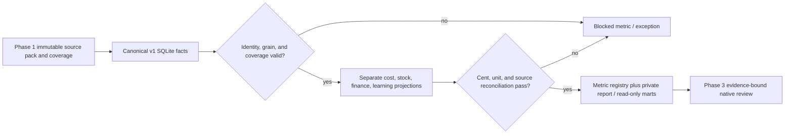

# Phase 2: Reconciled Decision Metrics — Research

## User Constraints

`02-CONTEXT.md` now records D-01..D-07 from `.planning/PROJECT.md`, `.planning/REQUIREMENTS.md`, `.planning/ROADMAP.md`, and `AGENTS.md`: a parallel aggregate-specific v1 workspace; integer MXN cents and Decimal input arithmetic; distinct missing, partial, zero, not-applicable, estimated, and error states; private cuts only under ignored `.local/`; exact SQL/Python calculations; native interpretation with independent review; no external business execution; no fabricated customer/order detail; backward compatibility with v0.2/v0.3. Phase 1 `01-CONTEXT.md` now defines 22 sources including cash-balance evidence and aggregate delivery-cohort links. [VERIFIED: codebase `.planning/phases/02-reconciled-decision-metrics/02-CONTEXT.md`, `.planning/phases/01-versioned-operating-intake/01-CONTEXT.md`, `AGENTS.md`]

## Phase Requirements

| ID | Description | Research support |
|---|---|---|
| MET-01 | Versioned known/complete cost, markup, gross margin, contribution, reconciled allocation | Cost version and allocation contracts; exact cent rules |
| MET-02 | Reconciled purchasing, receipts, stock statuses | Canonical event/state bridge and unit invariants |
| MET-03 | Obligations, payments, layered cash at 8/13 weeks | Obligation application and mutually exclusive cash layers |
| MET-04 | Product learning with denominator, maturity, exposure, demand coverage | Cohort and availability definitions |
| MET-05 | Budget/drop/channel states and reconciliation | Non-additive state model and allocation bridge |
| MET-06 | Readiness, quality, custody action queue without cost leakage | Restricted projection and exception contract |
| MET-07 | Full metric definition metadata | Registry schema and validation tests |

Requirement text and phase assignment are verified in `.planning/REQUIREMENTS.md` and `.planning/ROADMAP.md`. [VERIFIED: codebase `.planning/REQUIREMENTS.md`, `.planning/ROADMAP.md`]

## Summary

Build Phase 2 as deterministic materializations over the immutable Phase 1 v1 cut. The source of truth is the Phase 1 canonical aggregate facts and their coverage manifest, not `scripts/build_costs_operations.py` or the v0.2 order-level warehouse. The older slice supplies proven examples for partial cost, receipt bridge, obligation balance, and scenario isolation; it is synthetic, separate, and limited to eight sources. [VERIFIED: codebase `.planning/research/INTEGRATION-GAPS.md`, `scripts/build_costs_operations.py`, `specs/COSTS-OPERATIONS-v3.md`]

The planner should first finalize the exact Phase 1 relation names and field mappings, then implement three independent calculation families: (1) cost and unit reconciliation; (2) obligations, cash, and budget allocation; (3) product learning and restricted exception outputs. Each family must publish an as-of cut identity, source lineage, coverage status, and an independent reconciliation result. A metric value is publishable only when its particular sources and denominator are eligible; lack of one domain must not erase unrelated measured metrics. [VERIFIED: codebase `.planning/PROJECT.md`, `docs/DOMAIN.md`; ASSUMED: recommended Phase 2 decomposition]

**Primary recommendation:** Register one canonical metric contract per measure, materialize integer facts with SQLite, calculate ratios and residual cents with Python `Decimal`, and fail publication on broken identity or conservation checks. [CITED: https://www.sqlite.org/lang_aggfunc.html; CITED: https://docs.python.org/3/library/decimal.html; ASSUMED: implementation choice]

## Architectural Responsibility Map

| Capability | Primary tier | Secondary tier | Rationale |
|---|---|---|---|
| Source identity, coverage, temporal metadata | Phase 1 SQLite workspace | Python importer | Immutable canonical input to all Phase 2 metrics. [VERIFIED: codebase `.planning/ROADMAP.md`] |
| Exact aggregation and event reconciliation | SQLite analytical layer | Python control runner | Relational joins and integer sums; validate controls before publishing. [VERIFIED: codebase `alma/warehouse.py`] |
| Decimal ratios, cent allocation, JSON rendering | Python analytical layer | SQLite source projection | Explicit rounding and unknown serialization. [CITED: https://docs.python.org/3/library/decimal.html] |
| Owner-facing exceptions and metric catalog | Private report artifacts | SQLite marts | Read-only projections from verified rows. [VERIFIED: codebase `AGENTS.md`, `.planning/PROJECT.md`] |
| Interpretation and approvals | Phase 3 native cycle / human owner | Phase 2 evidence | Phase 2 has no action executor. [VERIFIED: codebase `.planning/ROADMAP.md`, `AGENTS.md`] |

## Project Constraints (from AGENTS.md)

- Use repository-local GitHub access and never publish `.local/`, `.local-archive/`, credentials, or customer information. No GitHub operation is needed for this research. [VERIFIED: codebase `AGENTS.md`]
- For an authorized analytical cycle, use `agents/RUN-NATIVE-CYCLE.md` and real native Codex tasks; Phase 2 produces deterministic metrics and does not itself run a cycle. [VERIFIED: codebase `AGENTS.md`]
- SQL/Python calculate exact values; preserve integer cents, unknown coverage, temporal recognition, synthetic markers, and source hashes. [VERIFIED: codebase `AGENTS.md`]
- Recommendations need primary metric, guardrail, population, window, and closure rule; no customer PII or external business execution. [VERIFIED: codebase `AGENTS.md`]
- Keep the local analytical CLI, relational data, process, and report architecture; do not introduce a frontend, HTTP backend, store, CRM, or ERP. [VERIFIED: codebase `AGENTS.md`]

## Standard Stack

| Component | Version / availability | Purpose | Evidence |
|---|---|---|---|
| Python standard library (`sqlite3`, `decimal`, `datetime`, `json`, `unittest`) | Project requires Python 3.11+; `pyenv-win` has 3.11.7 installed, but the `python` shim has no selected version in this shell | Build, calculate, test, serialize | [VERIFIED: codebase `.planning/PROJECT.md`, `.planning/codebase/STACK.md`; VERIFIED: local CLI probe 2026-09-22] |
| SQLite via Python `sqlite3` | Runtime version to re-probe with an explicit Python 3.11 executable | Typed facts, joins, integer aggregation, read-only marts | [VERIFIED: codebase `alma/warehouse.py`; CITED: https://www.sqlite.org/stricttables.html] |
| Project `unittest` suite | Existing | Phase-local invariants and negative controls | [VERIFIED: codebase `.planning/codebase/TESTING.md`, `tests/test_costs_operations.py`] |

No new package is required for Phase 2. Do not install a statistical, money, or ORM package for these deterministic marts. `openpyxl` and `XlsxWriter` remain Phase 4 workbook tools, already pinned in `requirements-client.txt`. [VERIFIED: codebase `.planning/codebase/STACK.md`, `requirements-client.txt`; ASSUMED: no-new-package recommendation]

SQLite `SUM(integer)` stays integer until overflow; `TOTAL()` and `AVG()` produce floating point. SQLite `REAL`, SQL ratio expressions that coerce to real, and `float(Decimal)` must not enter monetary truth. Validate input magnitude and aggregation overflow, then use Python `Decimal` for ratios and display rounding. [CITED: https://www.sqlite.org/lang_aggfunc.html; CITED: https://www.sqlite.org/floatingpoint.html; CITED: https://docs.python.org/3/library/decimal.html]

## Architecture Patterns



The Phase 1 source contract is now specified in `01-CONTEXT.md` as 22 CSV sources, while its implementation can still be in progress. Phase 2 must bind all 22 `SOURCE_NAMES` and the semantic key/date/unit/coverage fields to the final Phase 1 SQLite schema before implementation; a proposed relation name is not proof that a table exists. [VERIFIED: codebase `.planning/phases/01-versioned-operating-intake/01-CONTEXT.md`; ASSUMED: final schema binding]

### Component responsibilities

| Component | Responsibility |
|---|---|
| Phase 1 canonical facts | Stable cut ID, source row/event ID, effective/event date, canonical SKU and optional drop/channel IDs, source hash, synthetic flag, coverage and quality. [VERIFIED: codebase `.planning/ROADMAP.md`, `.planning/REQUIREMENTS.md`] |
| Phase 2 SQL projections | Preaggregate each source at its own grain before joining; expose integer cents/units and eligibility flags. [ASSUMED: implementation pattern] |
| Phase 2 Python controls | Decimal percentage/price arithmetic, deterministic remainder cents within one SKU/cost version, registry and separate versioned policy validation, publication gate, private JSON/CSV. [ASSUMED: implementation pattern] |
| Read-only exports | Carry value, status, denominator, window, source refs, cut hash, policy hash/status and reconciliation state; sales-facing export uses row-category, field and value allowlists that exclude cost and finance disclosure. [VERIFIED: codebase `AGENTS.md`, `.planning/REQUIREMENTS.md`; ASSUMED: export contract] |

### Universal metric row and registry

Every metric definition should include `id`, `formula`, `unit`, `grain`, `window`, `sources`, `unknown`, `guardrail`, `owner`, `decision_use`, and `version`. Each output row should include `cut_id`, `as_of`, dimension keys, numerator, denominator (when applicable), value, status (`MEASURED`, `PARTIAL`, `UNKNOWN`, `NOT_APPLICABLE`, `ESTIMATED`, `ERROR`), coverage refs, source refs/hashes, and reconciliation ID. Reject a missing registry field or a value whose source status does not satisfy its rule. [VERIFIED: codebase `.planning/REQUIREMENTS.md`, `.planning/PROJECT.md`, `client/costs-operations-manifest.json`; ASSUMED: proposed row schema]

### Versioned decision policy input

Keep business policy separate from Phase 1 source facts and from metric definitions. `contracts/operating-metrics-policy-v1.schema.json` defines required `policy_version`, effective interval, approval `status` (`REVIEW`, `APPROVED`, `SYNTHETIC_EXAMPLE`), owner approval reference for `APPROVED`, merchandise revenue/cost/variable-cost bases, return/quality maturity days, availability and budget allocation bases, owner roles, thresholds and cash projection selection. A public `policies/operating-metrics-synthetic-v1.json` supplies explicit synthetic example values without claiming owner approval. Compute SHA-256 over canonical policy artifact bytes and store the hash, path class, status and version in the derived bundle, separate from cut/source hashes; the hash is not a field in its own preimage. The builder accepts `policy_path` explicitly. Missing or stale policy blocks dependent policy calculations, unapproved real cuts remain `REVIEW`, and synthetic policy cannot approve a real cut. Test each case. [VERIFIED: source boundaries in `.planning/PROJECT.md`; ASSUMED: Phase 2 policy contract]

Use a single cut as-of in the declared timezone. Date-window filters must be explicit and half-open, `[start, end)`, so adjacent weeks do not overlap; an eight-week horizon has 56 local calendar days and a thirteen-week horizon has 91. Record source event date separately from reporting/materialization time. An undated item remains in an undated bucket and never enters a dated week by guessed date. [VERIFIED: codebase `.planning/REQUIREMENTS.md`, `.planning/PROJECT.md`; ASSUMED: half-open convention]

### 02-01: Cost, purchase, receipt, and inventory

| Mart and grain | Formula / conservation | Unknown and temporal rule |
|---|---|---|
| Cost version: `cost_version_id × SKU`, effective interval | `known_component_sum_cents = Σ distinct included, known source components + allocated shares`; `complete_cost_cents` exists only if every required component is present and allocation control passes. Keep `COMPLETE_DOCUMENTED` distinct from `COMPLETE_ESTIMATED`. [VERIFIED: codebase `specs/COSTS-OPERATIONS-v3.md`, `scripts/build_costs_operations.py`; ASSUMED: version interval contract] | Select version effective on the measured sale/receipt date, not latest version at report time. Reject overlapping approved effective versions per SKU. Missing source amount, required component, quantity basis, or conflicting inclusion leaves complete unit cost `UNKNOWN`; known partial sum may remain visible with `PARTIAL`. [VERIFIED: codebase `.planning/ROADMAP.md`, `specs/COSTS-OPERATIONS-v3.md`; ASSUMED: tie policy] |
| Cost allocation: one `component_id × owning SKU/cost version` | Phase 1 permits a cost component allocation only to its cost version's SKU. `Σ allocated_cents + unallocated_cents = source component cents`, exactly once. When batch cents need integer per-unit assignment, distribute within that same SKU/cost version by stable unit ordinal; 101 cents over three units is 34+34+33. [VERIFIED: codebase `01-CONTEXT.md` D-03/D-04; ASSUMED: deterministic unit-ordinal distribution] | Do not invent multi-SKU component targets; no source component counts both directly and through allocations. Missing quantity basis leaves unallocated cents visible. [VERIFIED: codebase `01-CONTEXT.md`; ASSUMED: mart behavior] |
| Realized economics: `SKU × channel × window × effective cost version` | Use eligible Phase 1 aggregate `net_revenue_cents` at the same grain; `gross_profit = net merchandise revenue - complete landed COGS`; `gross_margin = gross profit / net merchandise revenue`; `contribution = gross profit - complete variable selling/fulfilment`; `contribution_margin = contribution / net merchandise revenue`; `merchandise_markup = gross profit / complete landed COGS`. Keep public list price separate and do not invent a discount source. [VERIFIED: codebase `01-CONTEXT.md` D-03; ASSUMED: management formula requiring policy] | Zero denominator -> `NOT_APPLICABLE`; missing/estimated cost basis propagates status. Do not call fiscal/net profit. Tax, shipping, discount and inclusion bases reside in versioned policy; real cut stays `REVIEW` until approved. [VERIFIED: codebase `.planning/PROJECT.md`; ASSUMED: policy boundary] |
| Purchase/receipt: `purchase_order_id × as_of`, receipt event separately | `ordered = received + still_to_receive` for live orders; Phase 1 disposition is exactly `received_units = inspection_units + accepted_units + rejected_units`. Example 20 ordered / 18 received / 2 under inspection / 16 accepted gives 2 still to receive. [VERIFIED: codebase `01-CONTEXT.md` D-03/D-04] | Cancellation is separate; no invented `accepted_non_sellable` field. Duplicate receipt ID fails intake or mart publication. Missing receipt coverage never becomes zero. [VERIFIED: codebase `01-CONTEXT.md`; ASSUMED: mart behavior] |
| Inventory: `SKU × as_of`, event ledger at unique movement ID | Derive owned and sellable custody from the sole `inventory_movements` stock delta ledger and explicit `inventory_counts` observations; `available = sellable_on_hand - active_reserved`, nonnegative. Derive non-sellable from `inventory_counts.non_sellable_units`, rejected/quality evidence, and permitted movement types only where their as-of reconciliation makes it determinate. [VERIFIED: codebase `01-CONTEXT.md` D-03/D-05; ASSUMED: mart state derivation] | A count is variance control, not additive receipt. Receipt plus movement is one stock entry; return report alone adds none. Where non-sellable or other custody buckets cannot be fully determined, mark partial/unknown; unresolved variance or missing movement coverage blocks affected available/valuation. [VERIFIED: codebase `01-CONTEXT.md`; ASSUMED: block scope] |

Use batch-level unit economics when source cents do not divide evenly by units. If individual integer unit costs are required, assign the remainder cent to stable unit ordinals and prove the assigned total equals source cents; do not use integer truncation as a complete cost. The old synthetic slice sets unit cost to `None` if not divisible, which is safe but insufficient for a full v1 allocation. [VERIFIED: codebase `scripts/build_costs_operations.py`; ASSUMED: proposed v1 allocation]

### 02-02: Obligations, payments, cash, budget, drop, channel

| Mart and grain | Formula / conservation | Unknown and temporal rule |
|---|---|---|
| Obligation: `obligation_id × as_of` | `recorded_applied_cents = Σ distinct settled application IDs`; `recorded_unpaid_cents = original_cents - recorded_applied_cents - documented_adjustments_cents`. Require `0 ≤ applied ≤ adjusted original`. The obligation is the sole liability fact; a PO, invoice, and budget commitment are lineage/state, never duplicate liabilities. [VERIFIED: codebase `specs/COSTS-OPERATIONS-v3.md`, `.planning/research/DOMAIN.md`; ASSUMED: adjustments model] | Only call the result authoritative outstanding when payment/application coverage is complete through as-of. Otherwise label recorded unpaid exposure `PARTIAL`; an undated due date enters `undated`, not an arbitrary week. [VERIFIED: codebase `.planning/REQUIREMENTS.md`; ASSUMED: partial label] |
| Cash actual: `account × transaction ID × settlement date` and `week × layer` | `reconciled_close = verified_opening + Σ settled inflow - Σ settled outflow ± verified adjustments`. Processor authorization/capture is not cash until settlement. Verify closing against independent bank/count evidence before `RECONCILED`. [VERIFIED: codebase `docs/DOMAIN.md`, `.planning/research/DOMAIN.md`; ASSUMED: opening policy] | Missing or unverified opening produces cash movement and an `UNKNOWN` close, not invented available cash. [VERIFIED: codebase `.planning/PROJECT.md`, `tests/test_costs_operations.py`] |
| Cash forecast: `scenario × week × layer` | Publish separate `reconciled`, `committed`, `expected`, `undated`, and `scenario` components. A displayed projection is `verified opening + settled post-opening actual + dated outstanding commitments + selected expected events + selected scenario delta`, with every source event assigned once by precedence and linked to its obligation/settlement. [VERIFIED: codebase `.planning/REQUIREMENTS.md`, `specs/COSTS-OPERATIONS-v3.md`; ASSUMED: projection construction] | Compute 8 and 13 weeks from same dated facts; show all intervening daily closes or state that weekly minimum does not prove daily cash-floor safety. Keep unapproved scenarios separate from baseline and carry undated exposure beside, not inside, a date bucket. [VERIFIED: codebase `client/contract.json`, `.planning/REQUIREMENTS.md`; ASSUMED: presentation] |
| Budget/drop/channel: `budget_version × drop/channel` and `source expense/commitment × allocation target` | Distinct columns: `approved_ceiling`, `open_commitment`, `incurred`, `paid`, `outstanding_obligation`, `unallocated`. `headroom = approved_ceiling - (open_commitment + incurred allocated to budget)` only when states are mutually exclusive by source ID; paid is a settlement of incurred, not added exposure. `Σ target allocation + unallocated = each source cents`. [VERIFIED: codebase `.planning/research/DOMAIN.md`, `.planning/REQUIREMENTS.md`; ASSUMED: headroom policy] | A PO/expense/obligation/payment chain needs one economic source ID. Reject ambiguous many-to-many join multiplication. Missing drop/channel mapping retains `unallocated` and blocks fully allocated comparison, not unrelated total actuals. [VERIFIED: codebase `.planning/PROJECT.md`; ASSUMED: mart behavior] |

For each cash event, store `economic_event_id`, layer, original source ID, settlement/due/expected date, `scenario_id` if applicable, and replacement/supersession reference. A committed obligation fulfilled by a settled payment must move between layers for the relevant as-of; it must never appear in both actual and future committed outflow. [ASSUMED: recommended design derived from no-double-count requirement]

### 02-03: Product learning and action queues

| Mart and grain | Metric / action rule | Eligibility and interpretation |
|---|---|---|
| Launch sell-through: `SKU/variant × launch cohort × fixed window` | `net_depleted_units = delivered/shipped units - accepted restocked customer-return units`; `sell_through = net_depleted_units / (eligible opening sellable units + accepted purchase receipts during window)`. Preserve gross shipped, returned, and restocked separately. [VERIFIED: codebase `docs/DOMAIN.md`; ASSUMED: v1 aggregate source mapping] | Use only a declared launch start/end and complete stock/sales/return coverage. Denominator zero -> `NOT_APPLICABLE`; incomplete denominator/numerator -> `UNKNOWN` or `PARTIAL`. A stockout limits observed sales and cannot prove weak preference. [VERIFIED: codebase `docs/DOMAIN.md`, `.planning/ROADMAP.md`] |
| Variant mix: `drop/channel × variant × window` | `variant eligible delivered units / Σ eligible delivered units for same exposure set`; show actual delivered units and observed availability days alongside percentage. [ASSUMED: descriptive metric specification] | Mix is descriptive unless exposure, channel, price, and availability are comparable. No inference of preference from unexposed colors/sizes. [VERIFIED: codebase `docs/MARKET-RESEARCH.md`, `.planning/research/DOMAIN.md`] |
| Mature return/quality: `delivery or receipt cohort × variant × maturity window` | `received-return units from eligible delivered cohort / eligible delivered units`; separately `confirmed-defect units from eligible inspected cohort / eligible inspected units`. Report request, physical return, inspection, refund, and restock as distinct events. [VERIFIED: codebase `docs/DOMAIN.md`, `.planning/research/DOMAIN.md`; ASSUMED: quality denominator] | A cohort is mature only after the declared return/quality observation window has elapsed and event coverage is complete. If aggregate returns cannot link to delivery cohort, return rate is `UNKNOWN` for that cohort; do not invent orders/customers. [VERIFIED: codebase `.planning/PROJECT.md`, `docs/DOMAIN.md`; ASSUMED: quality maturity rule] |
| Availability and unmet demand: `variant × day`, roll up to fixed window | Use Phase 1 `availability_daily` observed/sellable/stockout minutes for exposure and publish only recorded `unmet_demand` event units by source/reason/channel as a lower bound. [VERIFIED: codebase `01-CONTEXT.md` D-03; ASSUMED: rollup] | Source-wide coverage is available; channel-level logging coverage is not. Missing channel rows cannot become measured zero, even when source-wide coverage is complete. Incomplete daily exposure is `PARTIAL/UNKNOWN`. [VERIFIED: codebase `01-CONTEXT.md`; ASSUMED: metric behavior] |
| Readiness/quality/loan exception: `exception ID × cut` | Rows contain category, canonical SKU/drop/channel/event reference, severity, evidence, owner role, next action, due date, closure status, and closure evidence ref. Candidate rules: incomplete cost for internal review; uninspected receipt; unresolved quality defect; blocked/review readiness code; overdue loan or missing custody receipt. [VERIFIED: codebase `.planning/REQUIREMENTS.md`, `01-CONTEXT.md`; ASSUMED: candidate rules] | Phase 1 has no separate asset/rights source. Sales projection requires both row-category and field allowlists plus allowed-value tests; no cost, margin, supplier, bank, budget or recipient disclosure. Missing owner/due/closure evidence remains unresolved. [VERIFIED: codebase `01-CONTEXT.md`, `AGENTS.md`; ASSUMED: allowlist] |

The return/quality maturation length, availability observation cadence, drop/channel allocation basis, and owner/threshold rules are versioned policy inputs in the separate artifact above. Real cuts without approved applicable policy remain `REVIEW`; synthetic fixtures exercise example values without implying owner approval. [VERIFIED: codebase `.planning/PROJECT.md`, `docs/DOMAIN.md`; ASSUMED: policy implementation]

## Don't Hand-Roll

| Problem | Use instead | Why |
|---|---|---|
| Financial decimal arithmetic | Python `Decimal`, integer cents at rest | Decimal supports explicit fixed-place rounding; SQLite `REAL` is approximate. [CITED: https://docs.python.org/3/library/decimal.html; CITED: https://www.sqlite.org/floatingpoint.html] |
| Referential integrity and typed source storage | SQLite `STRICT`, primary/foreign keys, `PRAGMA foreign_keys=ON`, `foreign_key_check` | SQLite requires foreign-key enforcement per connection and supports strict typing. [CITED: https://www.sqlite.org/stricttables.html; CITED: https://www.sqlite.org/foreignkeys.html] |
| Test harness | Existing `unittest`, temporary SQLite databases and small hand-calculated fixtures | Matches existing verification style. [VERIFIED: codebase `.planning/codebase/TESTING.md`] |
| User/customer identity reconstruction | Phase 1 aggregate source coverage | Aggregate workbooks cannot yield factual orders or customers. [VERIFIED: codebase `.planning/PROJECT.md`, `.planning/research/INTEGRATION-GAPS.md`] |

## Common Pitfalls

1. **Join multiplication:** Joining allocations, receipts, payments, and budgets at different grains multiplies source cents/units. Preaggregate per canonical ID and reconcile every source amount before dimension joins; test a source with two targets and two payments. [ASSUMED: risk and control]
2. **Status double counting:** A paid obligation remains in a committed cash row, or a payment is added to incurred spend. Use event-state precedence and one economic event ID across projections. [VERIFIED: codebase `.planning/research/DOMAIN.md`; ASSUMED: implementation control]
3. **Receipt/return double entry:** Physical receipt and acceptance movement both increment stock; return report and restock both increment stock. Link each transition to one event and test duplicate/replayed IDs. Derive non-sellable from observed counts and allowed quality/movement evidence, not an invented receipt field. [VERIFIED: codebase `.planning/REQUIREMENTS.md`, `01-CONTEXT.md`]
4. **Silently complete cost:** Missing component becomes zero, estimates become documented, or later version rewrites historical economics. Publish known partial sum and cost-version-specific complete value separately. [VERIFIED: codebase `specs/COSTS-OPERATIONS-v3.md`, `.planning/ROADMAP.md`]
5. **Floating-point leak:** `TOTAL`, `AVG`, `1.0 * amount`, `float(Decimal)`, or JSON numeric ratio used as financial truth. Keep cents integer, ratio as Decimal-quantized string or numerator/denominator pair. [CITED: https://www.sqlite.org/lang_aggfunc.html; CITED: https://www.sqlite.org/floatingpoint.html]
6. **False demand/quality signal:** An unmatured return cohort or unavailable variant is reported as low returns or poor preference. Gate on exposure, complete cohort linkage, and maturity; no channel-level zero from source-wide unmet-demand coverage. [VERIFIED: codebase `docs/DOMAIN.md`, `docs/MARKET-RESEARCH.md`, `01-CONTEXT.md`]
7. **Bank balance overclaim:** Assumed opening plus forecast flows is labeled reconciled cash. Require independent opening/closing evidence and preserve scenario/expected labels. [VERIFIED: codebase `tests/test_costs_operations.py`, `.planning/PROJECT.md`]
8. **Private data in output:** A sales export includes an internal exception row or puts cost/recipient data in an allowed string field; a path escape publishes a filled cut. Apply row-category, field and value allowlists, canonical private-root checks, and traversal/symlink/outside-root negatives. [VERIFIED: codebase `AGENTS.md`, `.planning/REQUIREMENTS.md`; ASSUMED: controls]

## Code Examples

These are patterns to adapt to the Phase 1 schema, not ready-to-run source names. [ASSUMED]

```sql
-- Sum each fact at its native grain before joining. All amount columns are INTEGER cents.
WITH applied AS (
  SELECT obligation_id, SUM(amount_cents) AS applied_cents
  FROM canonical_payment_applications
  WHERE settlement_date < :window_end
  GROUP BY obligation_id
)
SELECT o.obligation_id, o.original_cents,
       COALESCE(a.applied_cents, 0) AS recorded_applied_cents,
       o.original_cents - COALESCE(a.applied_cents, 0) AS recorded_unpaid_cents
FROM canonical_obligations AS o
LEFT JOIN applied AS a USING (obligation_id);
```

The query's `COALESCE(...,0)` is valid only after the payment source is declared complete or the output is explicitly labeled partial; SQL null is not a substitute for source coverage. [VERIFIED: codebase `.planning/PROJECT.md`; ASSUMED: sample mapping]

```python
from decimal import Decimal, ROUND_HALF_UP

def ratio_text(numerator: int | None, denominator: int | None) -> str | None:
    if numerator is None or denominator is None or denominator == 0:
        return None
    return str((Decimal(numerator) / Decimal(denominator)).quantize(
        Decimal("0.0001"), rounding=ROUND_HALF_UP
    ))
```

The caller must distinguish `UNKNOWN` numerator from measured zero and `NOT_APPLICABLE` zero denominator. `Decimal.quantize` provides explicit precision and rounding. [CITED: https://docs.python.org/3/library/decimal.html; ASSUMED: output convention]

## Validation Architecture

`workflow.nyquist_validation` is absent from `.planning/config.json`, so validation is enabled under the GSD research contract. Existing tests use standard-library `unittest` and temporary fixtures; no additional framework is needed. [VERIFIED: codebase `.planning/config.json`, `.planning/codebase/TESTING.md`]

| Property | Value |
|---|---|
| Framework | `unittest` (Python 3.11+) [VERIFIED: codebase `.planning/codebase/TESTING.md`] |
| Config | No separate test config; discovery in `tests/`. [VERIFIED: codebase `.planning/codebase/TESTING.md`] |
| Quick run | Explicit 3.11 executable with `-m unittest discover -s tests -p test_operating_marts_*.py -v`; each task uses its narrower assigned file first. [ASSUMED] |
| Full run | Explicit 3.11 executable with `-m unittest discover -s tests -v` and `scripts/verify_v2.py --output build/verification-v2-phase2` in the final 02-03 automated gate. [VERIFIED: codebase `.planning/codebase/TESTING.md`; ASSUMED: Phase 2 output path] |

| Requirement | Required negative control / hand oracle | Proposed test |
|---|---|---|
| MET-01 | Missing required cost, estimated versus documented, overlapping versions, 101 cents over 3 unit ordinals within one SKU/cost version equals 34+34+33, historical version unchanged | `tests/test_operating_marts_cost_inventory.py` [ASSUMED] |
| MET-02 | 20/18/2/16 receipt with Phase 1 accepted/inspection/rejected fields; duplicate ID; return report without restock; active reservation and offsite loan; count variance; non-sellable derivation; unavailable coverage | same [ASSUMED] |
| MET-03 | 180,000 obligation / 100,000 applied / 80,000 recorded unpaid; duplicate payment; payment supersedes commitment; absent observed balance evidence stays unknown; undated due; 8/13-week boundary | `tests/test_operating_marts_finance.py` [ASSUMED] |
| MET-04 | Stockout-exposed variant, zero denominator, immature/unlinked cohort, recorded unmet observation versus absent channel row under source-wide coverage | `tests/test_operating_marts_learning.py` [ASSUMED] |
| MET-05 | One expense allocated across two drops/channels, residual cents, payment not additive to incurred, unallocated amount preserved | `tests/test_operating_marts_finance.py` [ASSUMED] |
| MET-06 | Missing owner/due/closure; loan custody due; sales-facing row-category, field and injected-value leakage negatives | `tests/test_operating_marts_learning.py` [ASSUMED] |
| MET-07 | Every definition matches emitted status; all 22 `SOURCE_NAMES`/semantic columns bind; missing/stale/unapproved/synthetic policy; private-root traversal/symlink/outside tests | `tests/test_operating_marts_cost_inventory.py`, `tests/test_operating_marts_learning.py` [ASSUMED] |

Wave 0 uses existing `unittest` infrastructure. Each plan's first red stage creates its assigned test file, and 02-01 creates a tiny two-cut Phase 1 synthetic fixture once the Phase 1 contracts land. The fixture needs hand-computed integer cents, variant/day exposure, explicit coverage and policy markers. Test build into temporary private roots, never committed filled cuts. Focused commands target under 60 seconds; record actual duration at execution. Full `unittest` discovery and `scripts/verify_v2.py` run as final 02-03 automated gates. [VERIFIED: codebase `.planning/ROADMAP.md`, `.planning/codebase/TESTING.md`; ASSUMED: proposed Wave 0]

## Security Domain

`security_enforcement` is absent from `.planning/config.json`, so include bounded security controls. This phase consumes local non-PII sources, produces private metrics, and has no network-facing auth/session surface. [VERIFIED: codebase `.planning/config.json`, `.planning/PROJECT.md`]

| ASVS area | Applies | Control |
|---|---|---|
| V2 authentication / V3 session | No product auth/session in this CLI phase | Keep private file boundaries; no login/session implementation. [VERIFIED: codebase `.planning/PROJECT.md`] |
| V4 access control | Yes for output disclosure | Sales-facing row-category/field/value allowlists and canonical private-root guard; traversal/symlink/outside-root negatives. [VERIFIED: codebase `AGENTS.md`, `.planning/REQUIREMENTS.md`; ASSUMED: exact control] |
| V5 input validation | Yes | Phase 1 typed schema and foreign keys; Phase 2 metric-registry/status validation and bounded numeric/date checks. [CITED: https://www.sqlite.org/stricttables.html; VERIFIED: codebase `.planning/REQUIREMENTS.md`] |
| V6 cryptography | Yes for integrity hashes, not encryption | Reuse SHA-256 source/cut hashes; no custom cryptography. [VERIFIED: codebase `.planning/PROJECT.md`, `alma/warehouse.py`] |

Known threat patterns: source-path/PII injection into a sales projection, allowed-field value leakage, traversal or symlink to a public output, duplicate event IDs, and stale source/policy hashes. Validate at intake and publication, preserve all hashes, guard the private root, and restrict export rows/fields/values. These are local risk mappings rather than a claim of ASVS certification. [VERIFIED: codebase `AGENTS.md`, `.planning/REQUIREMENTS.md`; ASSUMED: threat mapping]

## Environment Availability

| Dependency | Required by | Available | Version / fallback |
|---|---|---|---|
| Python 3.11+ | Calculations, tests | Installed, shell shim unselected | `C:\Users\erick\.pyenv\pyenv-win\versions\3.11.7\python.exe` candidate; verify exact executable before plan execution. [VERIFIED: local CLI probe 2026-09-22] |
| SQLite | Canonical workspace/marts | Via Python runtime, not yet probed | Query `sqlite3.sqlite_version` from explicit interpreter; require STRICT-capable version. [CITED: https://www.sqlite.org/stricttables.html; VERIFIED: local CLI probe 2026-09-22] |
| Network/paid inference | None for Phase 2 | Not required | SQL/Python only. [VERIFIED: codebase `AGENTS.md`, `.planning/ROADMAP.md`] |

There is no Phase 2 package installation and no missing dependency that blocks writing the plan. The Python shim selection is an execution setup item. [VERIFIED: local CLI probe 2026-09-22]

## Assumptions Log and Open Questions (RESOLVED)

These are resolved as implementation contracts, while business approval remains represented by the separate policy status. No synthetic policy becomes owner approval.

| ID | Resolution | Evidence and remaining gate |
|---|---|---|
| A1 | Use same-grain eligible aggregate `net_revenue_cents` and complete landed COGS for realized gross margin and markup; subtract complete variable selling/fulfilment for contribution. Keep list price separate. Tax, shipping and discount inclusion are explicit versioned policy bases. | `01-CONTEXT.md` has net revenue and cost versions; real cut is `REVIEW` until applicable owner-approved policy. No fiscal/net-profit claim. |
| A2 | Receipt disposition is exactly `received = inspection + accepted + rejected`; derive non-sellable from `inventory_counts.non_sellable_units`, quality evidence and permitted stock movements with as-of reconciliation. There is no `accepted_non_sellable` source column. | `01-CONTEXT.md` D-03/D-05; incomplete derivation yields `PARTIAL/UNKNOWN`, not invented units. |
| A3 | Phase 1 cash events have `economic_event_id`, supersession links and active-leaf semantics, plus separate `cash_balance_evidence`. Phase 2 sums one active event per identity/layer and labels close `RECONCILED` only against observed opening/closing evidence. | `01-CONTEXT.md` D-03/D-11; absent or stale balance evidence yields unknown close. |
| A4 | `delivery_cohort_id` links aggregate delivery and quality/return events; numerator is physically received returns from mature linked cohorts and denominator is eligible delivered units. Maturity days come from policy. | `01-CONTEXT.md` D-03/D-04; unlinked/immature/partial cohort yields `UNKNOWN/REVIEW`. |
| A5 | `availability_daily` records SKU/day observed, sellable and stockout minutes. `unmet_demand` records events with source-wide coverage only; publish observed units as lower bound and never infer measured channel zero from an absent row. | `01-CONTEXT.md` D-03; incomparable exposure blocks preference inference. |
| A6 | Budget headroom uses approved ceiling less mutually exclusive open commitment and incurred allocation for one economic origin; payment is settlement, not added spend. Basis and effective window come from policy. | `01-CONTEXT.md` budget allocation/economic IDs; source-to-target plus unallocated cents must reconcile. |
| A7 | Phase 1 defines 22 ordered sources and semantic columns in `01-CONTEXT.md`. Task 02-01 binds its actual `SOURCE_NAMES`, tables/columns, keys, timezone and coverage after Phase 1 implementation; it fails on mismatch before marts publish. | Final names are an execution dependency, not a planning guess. |

External gates `EXT-01..03` still govern real client correctness, fiscal/accounting approval and Pilates-socks winner claims. [VERIFIED: codebase `.planning/REQUIREMENTS.md`, `.planning/PROJECT.md`]

## Sources

### Primary, high confidence

- `.planning/PROJECT.md`, `.planning/REQUIREMENTS.md`, `.planning/ROADMAP.md`, `.planning/research/DOMAIN.md`, `AGENTS.md` — current scope, requirements, boundaries. [VERIFIED: codebase]
- `specs/COSTS-OPERATIONS-v3.md`, `scripts/build_costs_operations.py`, `tests/test_costs_operations.py`, `docs/DOMAIN.md` — existing synthetic formulas, examples, and gaps. [VERIFIED: codebase]
- `alma/warehouse.py`, `.planning/codebase/ARCHITECTURE.md`, `.planning/codebase/TESTING.md` — existing SQLite, mart, test patterns. [VERIFIED: codebase]
- https://www.sqlite.org/lang_aggfunc.html — aggregate return types/overflow. [CITED: official SQLite documentation]
- https://www.sqlite.org/stricttables.html and https://www.sqlite.org/foreignkeys.html — typed storage and FK enforcement. [CITED: official SQLite documentation]
- https://www.sqlite.org/floatingpoint.html — exact-money caution. [CITED: official SQLite documentation]
- https://docs.python.org/3/library/decimal.html — Decimal rounding and `quantize`. [CITED: official Python documentation]

### Confidence assessment

- Existing architectural boundary and no-double-count invariants: **HIGH**, directly stated in project contracts and synthetic tests. [VERIFIED: codebase]
- Proposed v1 mart grains/formulas: **MEDIUM** as implementation guidance; owner policy and Phase 1 schema are pending. [ASSUMED]
- Real-business threshold, accounting, adoption, and Pilates-socks winner claims: **LOW/UNKNOWN** until authorized observed data and owner/qualified-reviewer policy. [VERIFIED: codebase `.planning/PROJECT.md`, `.planning/REQUIREMENTS.md`]

**Research date:** 2026-09-22. **Recheck before implementation:** after Phase 1 schema/contracts land or after 30 days, whichever is sooner. [VERIFIED: local date; ASSUMED: review interval]
