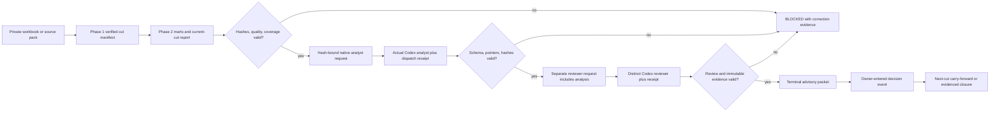

# Phase 3: Governed Weekly Decision Cycle - Research

**Researched:** 2026-09-22  
**Domain:** Private analytical cut → native Codex interpretation → independent review → owner decision continuity  
**Confidence:** HIGH for existing contracts; MEDIUM for v1 interfaces pending Phases 1–2

## User Constraints

No Phase 3 `CONTEXT.md` exists as of this research. The following governing text is copied verbatim from `.planning/PROJECT.md` and `AGENTS.md`; it must survive planning. [VERIFIED: `.planning/PROJECT.md`, `AGENTS.md`]

> - **Architecture**: Python 3.11+, SQLite, CSV/JSON/XLSX and offline HTML; no required server or paid inference provider.
> - **Money**: Integer MXN cents in relational data and Decimal at input boundaries; binary floats are prohibited for financial truth.
> - **Unknowns**: Missing, partial, zero, not applicable, estimated and error remain distinct.
> - **Privacy**: Public Git/release artifacts contain blank or synthetic data only; private cuts stay under ignored `.local/` paths.
> - **Agents**: Native Codex tasks provide interpretation; SQL/Python own exact calculations. A different agent reviews each analysis.
> - **Authority**: External business execution is always `PROHIBITED`.
> - **Compatibility**: Existing v0.2 and v0.3 evidence and release behavior remain regression protected.
>
> - For an authorized Alma de Lujo analysis cycle, follow `agents/RUN-NATIVE-CYCLE.md`. Read the current workspace manifest, process requests, role contracts and response schema. The task bridge requires actual native Codex execution; deterministic scripts are not LLM agents.
> - Delegate bounded native analytical roles and independent review when carrying out an authorized cycle. Native Terra handles inventory/finance, Luna handles commerce/returns, Sol handles growth/market synthesis, and Astra performs independent final review. Preserve other contributors' files and do not introduce paid inference providers.
> - Keep exact calculations in SQL/Python. Preserve unknown coverage, temporal recognition, integer MXN cents, synthetic markers and source hashes. Every recommendation needs a primary metric, guardrail, population, window and closure rule.
> - The product is an analytical system with CLI, relational data, processes and reports. Do not replace it with a frontend, HTTP backend, store, CRM or ERP. No real customer data or external business execution is authorized by an analytical run.

<phase_requirements>

## Phase Requirements

| ID | Description | Research support |
|---|---|---|
| FLOW-01 | Private workbook or v1 source pack produces current-cut report and evidence-hash-bound task bundle. | Intake/report hash chain and v1 bridge boundary below. |
| FLOW-02 | Native analyst responses validate schema and exact current-cut JSON references; cannot alter workspace. | Existing `native_agents` validator, immutable cut verification, and v1 changes below. |
| FLOW-03 | Distinct native reviewer; stale hashes, changed evidence and same identity fail closed. | Existing process/dispatch machinery and negative controls below. |
| FLOW-04 | Terminal packet separates facts, unknowns, hypotheses, recommendations with required action fields. | Packet projection and response schema guidance below. |
| FLOW-05 | Reviewed decision register with source hash, owner, due date, status, closure evidence; open/stale carry forward. | Register event model and two-cut tests below. |

</phase_requirements>

## Summary

Phase 3 should consume the verified aggregate v1 cut from Phases 1–2, bind its immutable manifest and exact report bytes into a task request, and accept only actual native Codex responses with parent-recorded dispatch receipts. The v0.2 bridge already has canonical JSON hashing, response-value checks, a distinct reviewer gate, hash-chained events, and a terminal packet. Its `synthetic_business_data=True`, `synthetic=True`, historical mart definitions, and synthetic role text make direct reuse for a private cut unsafe; add a v1-specific request/process adapter while preserving the released v0.2 path. [VERIFIED: `alma/process_engine.py`, `alma/native_agents.py`, `alma/workspace.py`, `agents/*.json`, `.planning/ROADMAP.md`]

The decision register is an owner-controlled continuation artifact, separate from the agent packet. A `READY_FOR_OWNER` packet is advisory and does not prove the owner accepted or executed a recommendation. Record a decision only from a verified packet and explicit owner entry; carry its stable ID and original source hash into the next cut, record new observations as new events, and close only with verifiable closure evidence. [VERIFIED: `agents/RUN-NATIVE-CYCLE.md`, `.planning/REQUIREMENTS.md`; RECOMMENDATION]

**Primary recommendation:** Implement a v1 cut bridge around verified manifest/report bytes, extend the existing native request/response validator for real or synthetic cut provenance, then build an append-only private decision event ledger with deterministic JSON/CSV projections and two-cut acceptance tests.

## Architectural Responsibility Map

| Capability | Primary tier | Secondary tier | Rationale |
|---|---|---|---|
| Source/report verification | Local analytical CLI | Private filesystem | Hash actual cut, mart and report bytes before task generation. [VERIFIED: `alma/client_review.py`, `alma/process_engine.py`] |
| Exact metrics and references | SQLite/Python analytics | Native task | Calculations and JSON Pointer validation remain deterministic. [VERIFIED: `alma/warehouse.py`, `alma/native_agents.py`] |
| Interpretation and independent challenge | Native Codex task runtime | Local process engine | Actual analyst/reviewer outputs are submitted through the bridge. [VERIFIED: `agents/RUN-NATIVE-CYCLE.md`] |
| Terminal packet and decision state | Local process engine | Private JSON/CSV | Packet reflects review; owner decision and later closure are separate persisted events. [VERIFIED: `.planning/REQUIREMENTS.md`; RECOMMENDATION] |

## Project Constraints (from AGENTS.md)

- Preserve project-local GitHub account isolation and never publish `.local/`, credentials, or real customer information. No GitHub operation is needed in Phase 3 implementation unless separately authorized. [VERIFIED: `AGENTS.md`]
- Native roles must be real Codex tasks; Terra inventory/finance, Luna commerce/returns, Sol growth/market synthesis, Astra independent final review. No paid provider. [VERIFIED: `AGENTS.md`, `agents/RUN-NATIVE-CYCLE.md`]
- SQL/Python own exact arithmetic, integer MXN cents and unknown semantics. Every recommendation carries metric, guardrail, population, window and closure. External business action remains prohibited. [VERIFIED: `AGENTS.md`]
- Maintain CLI/relational/report product form; do not introduce HTTP, storefront, CRM or ERP behavior. [VERIFIED: `AGENTS.md`]

## Standard Stack

| Component | Version/current state | Use |
|---|---|---|
| Python stdlib `hashlib`, `json`, `csv`, `sqlite3`, `pathlib`, `datetime`, `unittest` | Python 3.12.14 in project `.venv`; project floor 3.11+ | Continue existing hashes, local persistence, projections and tests. No new external package is required for Phase 3. [VERIFIED: `.venv/Scripts/python.exe --version`, `.planning/PROJECT.md`, `alma/storage.py`, `tests/test_process_engine.py`] |
| `alma.native_agents` and `alma.process_engine` | Repository contract v2.0 | Reuse canonical digest, request/response/dispatch validation, event journal and packet gates through a v1-specific adapter. [VERIFIED: source modules] |
| `openpyxl` | Pin `3.1.5` in `requirements-client.txt` | Existing workbook intake only; Phase 3 should call the established workbook validator, not parse workbook caches. [VERIFIED: `requirements-client.txt`, `alma/client_review.py`] |
| JSON Pointer RFC 6901 | Published RFC | Exact local references into request evidence; validate escape syntax and resolved values. [CITED: https://datatracker.ietf.org/doc/html/rfc6901] |

**Installation:** None for the core phase. Reuse the project environment and pinned optional workbook dependency; no package legitimacy audit is triggered by this research. [VERIFIED: `requirements-client.txt`, `.planning/PROJECT.md`]

## Architecture Patterns



### Recommended boundaries and task order

1. `03-01`: Phase 1 verifies workbook/source pack and exports one cut manifest; Phase 2 supplies a report and mart registry. The bridge accepts their paths and verifies manifest artifacts, report bytes, cutoff, timezone, coverage and source hashes before generating a request. Use the exact byte SHA-256 of `informe.json` or the v1 report plus the stable cut ID and manifest digest in request evidence. Store new private outputs under `.local/` in a fresh cut directory. Do not synthesize row-level orders/customers from workbook aggregates. [VERIFIED: `alma/client_review.py`, `alma/workspace.py`, `.planning/PROJECT.md`; RECOMMENDATION]
2. `03-02`: Build v1 requests with `cut_id`, source/report hash, `synthetic` flag reflecting the actual cut, metric definitions, quality and bounded report/mart JSON. Keep `request_id=digest(full request body)` and `evidence_hash=digest(evidence)`. An actual Codex task writes analyst response and trace; parent records actual task ID/model/effort/timestamps and response digest. Validate before accepting, then create reviewer request containing the unchanged cut evidence and accepted analysis; reject same `agent_id`. Reviewer `BLOCKED` must not become an owner-ready packet. [VERIFIED: `alma/native_agents.py`, `alma/process_engine.py`, `scripts/record_native_run.py`, `agents/RUN-NATIVE-CYCLE.md`; RECOMMENDATION]
3. `03-03`: Add private canonical JSON decision events and a deterministic CSV projection. A register entry references packet digest, cut ID, source hash, recommendation ID, owner, due date, status and closure rule. New cut imports and verifies the prior register anchor before evaluating carry-forward. A changed source hash creates a new observation/review event; it never silently overwrites the original decision. [VERIFIED: `.planning/REQUIREMENTS.md`, `client/REGISTRO_DECISIONES.csv`; RECOMMENDATION]

### Critical v0.2 seams

- `make_request()` hard-codes `synthetic_business_data=True`; `_packet()` hard-codes `synthetic=True`; agent contracts say `read: synthetic snapshot`; `process_engine._evidence()` expects historical files/marts and `definitions()` loads v0.2 process definitions. Add a v1 versioned adapter/contracts and test truthful real-vs-synthetic labels. Do not change historical response/packet bytes. [VERIFIED: `alma/native_agents.py`, `alma/process_engine.py`, `agents/*.json`, `processes/*.json`]
- The existing workbook review emits `informe.json`, SHA-256-linked HTML and `PARA_EL_ANALISTA.md`, but no native response or reviewer. `client/REGISTRO_DECISIONES.csv` is header-only. [VERIFIED: `alma/client_review.py`, `client/REGISTRO_DECISIONES.csv`]
- `validate_response()` checks exact typed observation values via resolved JSON pointers and requires recommendations to carry metric, guardrail, window, population, closure rule, approval and `execution=PROHIBITED`. It checks pointer existence for recommendation evidence, not the truth of narrative claims. The reviewer must challenge meaning, denominator, temporal fit and alternative explanations. [VERIFIED: `alma/native_agents.py`, `agents/evidence_reviewer.json`]
- `resolve_ref()` currently decodes `~1`/`~0`, but does not reject unknown `~` escape forms; a v1 strict pointer validator should reject those and preserve RFC 6901 unescaping order. [VERIFIED: `alma/native_agents.py`; CITED: https://datatracker.ietf.org/doc/html/rfc6901]
- `validate_dispatch()` checks receipt shape and native metadata, but the receipt is a parent attestation, not a cryptographic provider signature. Do not claim proof of model execution from a schema-valid fixture alone. [VERIFIED: `alma/native_agents.py`, `scripts/record_native_run.py`, `scripts/build_decision_book.py`]

### Decision register contract

Recommended canonical event fields: `version`, `event_id`, `decision_id`, `event_type`, `recorded_at_utc`, `cut_id`, `cutoff`, `source_hash`, `packet_hash`, `recommendation_id`, `owner`, `due_date`, `status`, `closure_rule`, `closure_evidence` (array of local artifact hash and exact JSON Pointer), `previous_hash`, `hash`. Enforce unique `event_id`; stable `decision_id` across cuts; append-only event transitions; ISO dates; no free-text PII. `REGISTERED` requires a reviewed `READY_FOR_OWNER` packet and explicit owner choice. `OPEN`/`IN_PROGRESS` carry forward. `STALE` is derived at next cutoff if due date passed and no valid closure. `CLOSED` requires a closure event whose evidence resolves in a verified cut and meets the declared rule; if the rule needs human judgment, store the owner attestation separately and leave analytical closure as `REVIEW` until it is supplied. [VERIFIED: `.planning/REQUIREMENTS.md`, `alma/process_engine.py`, `client/REGISTRO_DECISIONES.csv`; RECOMMENDATION]

Use canonical JSON as authority and generate CSV with exact columns from the verified state. If users edit CSV, import it as proposed events, validate every cell, and append accepted events; never trust a changed CSV as authoritative history. Bind each cut's register export to its digest and the prior cut's terminal digest. Hash chains detect local edits to a saved chain but are not signatures: if an adversary rewrites the entire chain and its only anchor, detection requires an independently retained prior anchor. [VERIFIED: `alma/storage.py`, `alma/process_engine.py`; RECOMMENDATION]

## Don't Hand-Roll

| Problem | Use instead | Why |
|---|---|---|
| LLM emulation in Python | Actual native Codex task and parent dispatch receipt | Deterministic fixture cannot establish interpretation or review. [VERIFIED: `agents/RUN-NATIVE-CYCLE.md`] |
| Financial arithmetic inside agent prose | Phase 2 SQL/Python marts and exact report references | Preserves cents, coverage and temporal recognition. [VERIFIED: `AGENTS.md`, `.planning/PROJECT.md`] |
| Custom hash encoding | Existing `storage.canonical()` and `native_agents.digest()` | Keeps byte-level digest rules consistent. [VERIFIED: source modules] |
| Loose string path lookup | Strict RFC 6901 JSON Pointer over frozen request evidence | Avoids ambiguous references and path/URL traversal. [VERIFIED: `alma/native_agents.py`; CITED: https://datatracker.ietf.org/doc/html/rfc6901] |

## Common Pitfalls

| Pitfall | Failure mode and prevention |
|---|---|
| Mislabeling a private cut synthetic | Current v0.2 request/packet literals say `true`; v1 must derive the marker from verified cut metadata and test both cases. [VERIFIED: `alma/native_agents.py`, `alma/process_engine.py`] |
| Hashing parsed JSON but showing changed report bytes | Bind exact report file SHA-256 and canonical evidence digest; verify both before submission and terminal read. [VERIFIED: `alma/client_review.py`, `alma/process_engine.py`; RECOMMENDATION] |
| Same-agent review | Compare actual `agent_id`, not just role/model strings; reject same identity at submission and terminal verification. [VERIFIED: `alma/process_engine.py`] |
| Fake native success in tests | Use disposable response fixtures only as validator tests; live acceptance requires runtime IDs and traces. [VERIFIED: `tests/test_process_engine.py`, `agents/RUN-NATIVE-CYCLE.md`] |
| Promoting advisory packet to owner decision | Require explicit owner register event; `READY_FOR_OWNER` remains a review state. [VERIFIED: `.planning/REQUIREMENTS.md`, `alma/process_engine.py`; RECOMMENDATION] |
| Losing unresolved decisions at cut boundary | Preserve stable ID, original source hash and due date; emit carry event and compute stale against next cutoff. [VERIFIED: `.planning/REQUIREMENTS.md`; RECOMMENDATION] |
| Reopening/closing via CSV edit | Treat CSV as projection or validated event input, never overwrite canonical JSON or silently change history. [VERIFIED: `alma/storage.py`, `alma/process_engine.py`; RECOMMENDATION] |
| Private data in release artifacts | Keep filled cuts, native responses and register under ignored `.local/`; public tests use blank/synthetic fixtures. [VERIFIED: `.gitignore`, `.planning/REQUIREMENTS.md`, `AGENTS.md`] |

## Code Examples

```python
# Existing verified primitives; adapt a v1 cut rather than mutate the released v0.2 path.
from hashlib import sha256
from alma.native_agents import digest, validate_response, validate_dispatch
from alma.process_engine import atomic

report_sha256 = sha256(report_path.read_bytes()).hexdigest()
evidence = {"cut_id": cut_id, "manifest_hash": digest(manifest),
            "report_sha256": report_sha256, "report": report,
            "quality": quality, "metrics": metric_definitions}
# Request is built from this frozen evidence; parent submits only after both
# validate_response(request, response) and validate_dispatch(receipt, request).
```

The first three functions and atomic writer exist; the `evidence` shape is a Phase 3 recommendation and must match the Phase 1–2 contracts once implemented. [VERIFIED: `alma/native_agents.py`, `alma/process_engine.py`; RECOMMENDATION]

## Validation Architecture

| Property | Value |
|---|---|
| Framework | stdlib `unittest`; no separate config. [VERIFIED: `tests/test_process_engine.py`, `.planning/codebase/TESTING.md`] |
| Quick run | `.venv/Scripts/python.exe -m unittest tests.test_process_engine tests.test_client_review -q` on Windows; use configured Python on Linux. [VERIFIED: project environment, test files] |
| Full suite | `.venv/Scripts/python.exe -m unittest discover -s tests -q` on Windows. [VERIFIED: `.planning/codebase/TESTING.md`] |

| Requirement | Essential acceptance/negative controls | Suggested file |
|---|---|---|
| FLOW-01 | The source-pack entry builds/verifies the Phase 1 workspace and Phase 2 bundle before task publication; a downstream workbook-derived cut is accepted only after it produces that same canonical workspace identity. Report/source byte mutation blocks task generation; malformed/partial input cannot become `READY_FOR_OWNER`. | `tests/test_weekly_cycle.py` (written test-first in Plan 03-01) |
| FLOW-02 | Valid actual-style response fixture accepts; stale request/evidence hash, nonexistent/invalid pointer, changed exact value, `null→0`, wrong role, extra fields, external action, workspace write attempt, missing registered-query trace or changed trace hash fail. | `tests/test_native_agents_v1.py` (written test-first in Plan 03-02) |
| FLOW-03 | Different native IDs pass; same ID with different model, changed analyst after reviewer dispatch, changed mart/report after dispatch, altered response/dispatch/query-trace receipt and reviewer `BLOCKED` fail terminal approval. | `tests/test_weekly_cycle.py` (written test-first in Plan 03-02) |
| FLOW-04 | Packet visibly preserves four categories and all recommendation fields; tampering packet or event journal fails status/resume. | `tests/test_weekly_cycle.py` (written test-first in Plan 03-02) |
| FLOW-05 | Two distinct weekly cuts: register reviewed decision, carry open one with original source hash, flag overdue one stale, close one with exact next-cut evidence; reject forged closure, duplicate ID, unknown owner/date, CSV formula injection and prior-anchor tamper. | `tests/test_decision_register.py` (written test-first in Plan 03-03) |

Test temporary synthetic cuts only. `tests/test_process_engine.py` already demonstrates small fixtures, changed evidence, distinct reviewer, journal tamper and terminal packet tamper. Phase 5 owns broader release/E2E gates, but Phase 3 must prove its own two-cut register behavior before handoff. [VERIFIED: `tests/test_process_engine.py`, `.planning/ROADMAP.md`]

## Security Domain

OWASP ASVS 5.0 is web-application guidance; this local CLI has no browser login/session or HTTP authorization surface in Phase 3. Its relevant control ideas are allowlisted input, canonical decoding, trusted-layer validation and protection of private data. [CITED: https://owasp.org/projects/asvs; https://github.com/OWASP/ASVS/blob/master/5.0/docs_en/OWASP_Application_Security_Verification_Standard_5.0.0_en.json]

| Category | Applies | Phase control |
|---|---|---|
| V1 Encoding and Sanitization | Yes | Escape terminal/HTML/CSV output and reject spreadsheet formula prefixes in editable CSV cells. [CITED: https://github.com/OWASP/ASVS/blob/master/5.0/en/0x10-V1-Encoding-and-Sanitization.md] |
| V2 Validation and Business Logic | Yes | Strict schema, dates, transitions, current-cut binding, exact references and fail-closed quality. [CITED: https://github.com/OWASP/ASVS/blob/master/5.0/docs_en/OWASP_Application_Security_Verification_Standard_5.0.0_en.json] |
| V3 Web Frontend / V4 API | No Phase 3 web/API surface | Keep this phase in the local CLI; do not imply a service authentication system. [VERIFIED: `.planning/PROJECT.md`, `.planning/REQUIREMENTS.md`] |
| V14 Data Protection | Yes | Private cut and native outputs remain in ignored local paths; release audit excludes them. [CITED: https://github.com/OWASP/ASVS/blob/master/5.0/en/0x23-V14-Data-Protection.md; VERIFIED: `.gitignore`, `AGENTS.md`] |

## Environment Availability

| Dependency | Required by | Available | Fallback |
|---|---|---|---|
| Project Python | CLI/tests | `.venv/Scripts/python.exe` 3.12.14; global `python` shim has no selected version. [VERIFIED: command probes] | Invoke project `.venv` on this machine. |
| SQLite | Relational cut/marts | Python stdlib `sqlite3` used in code; standalone `sqlite3` CLI not found in PATH probe. [VERIFIED: `alma/storage.py`, command probe] | Use Python module. |
| Native Codex runtime | Analyst/reviewer execution | Available to orchestrating task; not callable by Python module alone. [VERIFIED: `agents/RUN-NATIVE-CYCLE.md`] | Leave request `WAITING_AGENT`/`WAITING_REVIEW` until authorized live dispatch. |
| Workbook dependency | XLSX intake | Pinned `openpyxl==3.1.5` in requirements; installation in this environment not probed. [VERIFIED: `requirements-client.txt`] | Source-pack path remains available. |

## Assumptions Log

| # | Claim | Risk if wrong |
|---|---|---|
| A1 | [ASSUMED] Phase 1 will expose a versioned manifest with stable cut ID, artifact hashes, cutoff and coverage as the roadmap specifies; exact field names are pending implementation. | Adapter and tests must change to actual manifest schema. |
| A2 | [ASSUMED] Phase 2 will expose report/mart JSON and metric definitions consumable without querying private mutable data during native review. | Task bundle needs an export step or tighter evidence subset. |
| A3 | [ASSUMED] Owner identity/attestation is a local declared field rather than a cryptographically authenticated login. | If business requires authenticated signoff, Phase 3 cannot claim that assurance. |

## Open Questions (RESOLVED)

1. **Exact Phase 1–2 artifact names and manifest schema — RESOLVED:** Plan 03-01 depends on completed Plan 02-03 and must read the Phase 1–2 summaries before editing. It binds the implemented verifier/build exports named there through one versioned adapter. The Phase 3 entry accepts a v1 source-pack path and invokes those actual APIs; direct v1 workbook preparation remains Phase 4 ownership and may enter the cycle only after it produces the same verified Phase 1 workspace and Phase 2 bundle. No research-era filename is preserved when the implemented interface differs. [RESOLVED: `03-CONTEXT.md` D-01/D-02 and phase boundary]
2. **Business definition of “stale” — RESOLVED:** At the next verified cutoff, compare the decision due date with the cutoff's local date in its declared IANA timezone. An unresolved item becomes `STALE` when `due_date < cutoff_local_date`, unless an accepted extension event was recorded before that cutoff. [RESOLVED: `03-CONTEXT.md` D-08]
3. **Owner approval evidence — RESOLVED:** Phase 3 validates an explicit local owner-role attestation and bound artifact hashes. It does not claim cryptographic authentication. Human-judgment closure remains `REVIEW` until a separate allowlisted owner attestation is recorded; authenticated owner identity remains external gate EXT-01. [RESOLVED: `03-CONTEXT.md` D-07/D-08 and Deferred Ideas]

## Sources

- Repository primary: `.planning/PROJECT.md`, `.planning/ROADMAP.md`, `.planning/REQUIREMENTS.md`, `.planning/research/INTEGRATION-GAPS.md`, `AGENTS.md`, `agents/RUN-NATIVE-CYCLE.md`, `alma/{native_agents,process_engine,client_review,storage,workspace}.py`, `contracts/{native-agent-response,decision-packet-v2}.schema.json`, `tests/{test_process_engine,test_client_review}.py` — inspected 2026-09-22. [VERIFIED: codebase]
- [RFC 6901 JSON Pointer](https://datatracker.ietf.org/doc/html/rfc6901) — pointer syntax and escape rules. [CITED: https://datatracker.ietf.org/doc/html/rfc6901]
- [OWASP ASVS 5.0](https://owasp.org/projects/asvs) and [official ASVS requirements](https://github.com/OWASP/ASVS/blob/master/5.0/docs_en/OWASP_Application_Security_Verification_Standard_5.0.0_en.json) — current security control framing. [CITED: https://owasp.org/projects/asvs]

## Metadata

**Confidence breakdown:** Standard stack HIGH (existing repo and environment); architecture HIGH for existing bridge, MEDIUM for v1 fields pending Phases 1–2; pitfalls HIGH for current hard-coded seams and tests; register policy MEDIUM until owner/stale semantics are locked. [VERIFIED: codebase; ASSUMED for future phase interfaces]  
**Research date:** 2026-09-22  
**Valid until:** Recheck after Phases 1–2 produce their actual manifest/report contracts.
