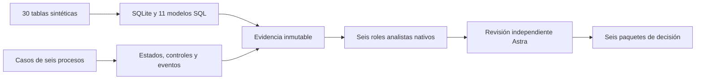

# Alma de Lujo · Growth & Business Analytics

Un sistema analítico para ropa deportiva y calcetines de Pilates, con un kit semanal de Excel para decidir qué reponer, revisar precios y anticipar faltantes de caja. El núcleo conserva datos relacionados, procesos ejecutables, análisis SQL y agentes nativos con revisión independiente.

**Los datos comerciales son sintéticos.** Las fuentes públicas de mercado están atribuidas por separado. Este proyecto no demuestra ventas o rentabilidad reales de Alma de Lujo.

## Para el cliente: empieza aquí

1. Abre el [sistema analítico navegable](client/SISTEMA_ANALITICO.html): muestra las 30 fuentes, 11 marts, 6 procesos, 7 roles, ejecuciones nativas, paquetes de decisión, métricas y linaje con evidencia verificable.
2. Recorre [costos y operación](client/COSTOS_Y_OPERACION.html): ocho tablas adicionales separan versiones/componentes de costo, recepción, disponibilidad, obligaciones, pagos y escenarios de caja.
3. Abre [EMPIEZA_AQUI](client/EMPIEZA_AQUI.md) y la [guía semanal](client/GUIA_SEMANAL.html).
4. Practica con [Alma_de_Lujo_EJEMPLO.xlsx](client/Alma_de_Lujo_EJEMPLO.xlsx); todos sus importes y productos son ejemplos sintéticos.
5. Guarda una copia privada de [Alma_de_Lujo_PLANTILLA.xlsx](client/Alma_de_Lujo_PLANTILLA.xlsx). Captura tus variantes, ventas agregadas, conteo y plan de caja en las celdas azules.
6. Revisa **DECISIONES** y **FLUJO_13_SEMANAS**. Registra responsable, siguiente paso y fecha en el [registro de decisiones](client/REGISTRO_DECISIONES.csv).

Para usar los libros no necesitas Python, GitHub ni una suscripción de IA. Se entregan para Excel de escritorio; otras suites necesitan su propia comprobación de compatibilidad. Las cantidades de compra son propuestas condicionales. Los parámetros iniciales son provisionales y deben revisarse con la operación.

El kit admite hasta **100 variantes, 1,000 agregados fecha/SKU y 250 movimientos de caja previstos**. Separa la propuesta de compra de la cantidad elegida, calcula el precio que cubre los costos y el margen objetivo, y evalúa **91 cierres diarios** agrupados en 13 semanas. La caja dentro de cada día y la exactitud de las fuentes no se presumen verificadas. [Contrato del kit](client/contract.json) · [Alcance](specs/CLIENT-v3.md).

El portal funciona sin servidor ni recursos remotos. Su manifiesto vuelve a calcular filas, campos, hashes, fórmulas, linaje y 49 hechos citados por los agentes. La extensión de costos mantiene sus ocho CSV separados de las 30 fuentes base y publica qué capacidades existen, cuáles siguen pendientes y qué propuesta de la adenda entra en conflicto con el alcance analítico actual. [Recorrido técnico](client/FUENTES_METRICAS_AGENTES.md) · [Aceptación](docs/CLIENT-SYSTEM-ACCEPTANCE.md).

### Revisión privada opcional por el analista

```powershell
python -m pip install -r requirements-client.txt
python scripts/review_client_workbook.py --input .local/corte.xlsx --output .local/client-runs/corte-001
```

Produce un informe HTML/JSON, correcciones con referencias de celda y una solicitud para revisión nativa dentro de Codex. Lee los datos de entrada y recalcula con aritmética independiente; no confía en resultados guardados en Excel. Los informes sólo pueden guardarse en una nueva subcarpeta de `.local/client-runs`, fuera de Git. La generación del informe prepara la solicitud del analista; no ejecuta una llamada a un modelo. **Los libros llenos y datos del cliente permanecen privados.** Los agregados de este kit no se convierten en pedidos o clientes ficticios del almacén v0.2.

## Sistema analítico y evidencia v0.2

[Libro de decisiones](evidence/v0.2/DECISION-BOOK.md) · [Dossier analítico](evidence/v0.2/workspace/DOSSIER.md) · [Tablas](evidence/v0.2/workspace/tables) · [SQL](models/marts) · [Procesos](specs/PROCESS-CATALOG.md) · [Agentes](specs/AGENT-SYSTEM.md)



## Qué contiene

| Componente | Implementación y evidencia |
| --- | --- |
| **30 tablas fuente** | SQLite STRICT, claves primarias/foráneas, restricciones, índices y catálogo por columna. [Diccionario](specs/DATA-DICTIONARY.md) |
| **11 modelos SQL** | Ventas, inventario, antigüedad, compras, caja, finanzas, canales, cohortes, experimentos, conversión y conciliaciones. [Métricas y linaje](specs/METRIC-CATALOG.md) |
| **6 procesos de negocio** | Transiciones legales, controles, excepciones, aprobaciones sintéticas, idempotencia y eventos inmutables. [Definiciones](processes/business) |
| **6 procesos analíticos** | Estados persistentes, solicitudes de agentes, respuestas vinculadas a evidencia, revisión y paquetes de decisión. [Motor](alma/process_engine.py) |
| **7 roles de agente** | Inventario, comercio, devoluciones, finanzas, growth, mercado y revisión. [Contratos](agents) |
| **Escenarios y experimentos** | Un año, 1,200 pedidos, 46 variantes, 22,844 registros; presión de inventario, descuentos, caja, costos faltantes y vínculos rotos. [Comparación](evidence/v0.2/SCENARIO-COMPARISON.md) |
| **Especificaciones verificables** | PRD, matriz de aceptación, arquitectura, procesos, datos, métricas y autoridad. [Specs](specs) |

Es un sistema de análisis con archivos, CLI y reportes exportables. No contiene una aplicación web, servidor, CRM/ERP ni ejecución de compras, pagos o reembolsos.

## Ejecutarlo

Python 3.11+ con SQLite moderno. El núcleo usa sólo la biblioteca estándar; no necesita API keys ni dependencias de pago.

```powershell
python -m alma workspace --output build/cycle-001
python -m alma process status --workspace build/cycle-001
python -m alma query --workspace build/cycle-001 --mart finance_monthly
python scripts/verify_v2.py --output build/verification-v2
```

En Windows también puede usarse `./run.ps1 -Command workspace -Output build/cycle-001`.

El workspace incluye el SQLite, CSV de todas las tablas, JSON, modelos derivados, linaje, controles, intervalos de experimentación, el dossier Markdown/HTML y el replay de procesos. Los procesos analíticos quedan en `WAITING_AGENT` hasta que los agentes nativos ejecutan sus tareas.

Para ejecutar la parte cognitiva dentro de Codex, seguir [RUN-NATIVE-CYCLE.md](agents/RUN-NATIVE-CYCLE.md). El código prepara y valida el intercambio de tareas; no presenta respuestas de reglas como si fueran llamadas a un modelo. Las ejecuciones reales del proyecto conservan su modelo, tarea, esfuerzo, tiempos, trazas, hashes y revisión. No hay un proveedor de inferencia facturable adicional ni un worker de terminal autónomo oculto.

Para importar las mismas tablas por CSV:

```powershell
python -m alma workspace --input build/cycle-001/tables --output build/imported-cycle
```

El importador exige el contrato exacto y el marcador sintético. Se preservan carpetas existentes; un cambio de datos o contrato usa un nuevo workspace. [Runbook completo](docs/RUNBOOK-v2.md).

## Cómo protege las conclusiones

- Ingreso y costo se reconocen por entrega; notas de crédito, devoluciones y reembolsos conservan efectos y fechas distintos. Caja usa eventos reales de la simulación de cobro/pago, sin inventar saldo bancario inicial.
- Inventario separa existencia, reservado, disponible, tránsito y conteo. Muestras y conceptos permanecen PRELAUNCH. El reabasto es una propuesta con supuestos.
- Las cohortes usan primera entrega y ventanas de recompra comparables. El embudo distingue sesiones vinculadas, leads sin sesión y pedidos; conserva campañas con gasto y cero órdenes.
- Una fuente incompleta produce UNKNOWN/NULL. Un vínculo roto bloquea la carga; un lote repetido es no-op; un duplicado contradictorio preserva los datos aceptados.
- Un agente cita valores exactos del snapshot. El motor rechaza solicitudes sustituidas, hashes viejos y paquetes alterados. Un agente diferente revisa las inferencias; los permisos externos permanecen prohibidos.

## Verificación

La verificación v0.2 reúne **67 pruebas automáticas**, seis escenarios, mecanismos de estrés y replay, integridad de importación, oráculos financieros y revisión adversarial independiente. [Resultados](evidence/v0.2/verification.json) · [Revisión Astra](docs/ADVERSARIAL-REVIEW-v2.md) · [CSV roundtrip](evidence/v0.2/interchange.json).

[Matriz de aceptación ejecutada](evidence/v0.2/acceptance.json) · [Recibos y trazas de agentes](evidence/v0.2/agents/task-runs.json) · [Identidad de modelos verificada](evidence/v0.2/agents/model-provenance.json) · [Instalación limpia](evidence/v0.2/clean-install.json) · [Release](docs/RELEASE.md).

Los estados de aceptación, las ejecuciones de agentes y la publicación se verifican como evidencias separadas. La consistencia de una simulación no prueba adopción, exactitud de datos externos ni impacto comercial.

## Límites y continuidad

El usuario confirmó ropa deportiva y calcetines de Pilates de varios colores. La hipótesis de producto ganador permanece sin validar con ventas reales. El registro de mercado incluye observaciones públicas de INEGI con población y fecha; el acceso a las últimas prendas de Instagram no se pudo verificar. Ninguna fotografía, precio o existencia de la marca fue inventada como observada.

Las integraciones de Instagram, pagos, inventario y datos reales, así como políticas definitivas y contabilidad fiscal, requieren una fase posterior específica. El núcleo está preparado para nuevos snapshots y análisis dentro de Codex. [Arquitectura](specs/ARCHITECTURE.md) · [Investigación](research/source-register.json) · [Eficiencia de modelos](PROJECT-EFFICIENCY.md).

## English overview

A local Growth & Business Analytics system for sportswear and Pilates socks. It provides 30 typed relational source tables, 11 SQL marts, six executable synthetic business lifecycles, six durable analytical processes, and seven native Codex role contracts. The seeded 365-day case contains 1,200 orders and 46 variants. All commercial data is simulated; attributed public research is kept separate.

The native task bridge binds evidence, validates exact-value citations and requires an independent reviewer. It does not call a separately billed API or pretend that deterministic calculations are agents. The terminal build is reproducible offline; cognition runs in a native Codex task. See the [operating procedure](agents/RUN-NATIVE-CYCLE.md), [specification](specs/PRD.md), [SQL](models/marts), and [verification](evidence/v0.2/verification.json).

## License and provenance

Project code and synthetic fixtures: [MIT](LICENSE). Public sources retain their own terms and attribution. GitHub access is isolated to `erickinorganico` for this repository; no global account switch is required. [Access documentation](docs/GITHUB-ACCESS.md).

The compact v0.1 baseline remains available under tag `v0.1.0` and through `python -m alma demo` for regression comparison.
