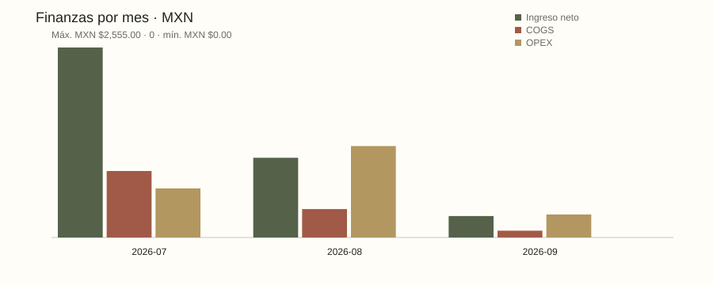

# Alma de Lujo · Growth & Business Analytics

Un MVP analítico reproducible para una marca de ropa deportiva, con **datos de negocio 100% sintéticos**. Conecta investigación de mercado, catálogo, compras, inventario, comercio, finanzas y experimentos de Growth. Los calcetines de Pilates multicolor son una hipótesis de producto principal aportada por el usuario; los datos simulados no la validan.

[English](README.en.md) · [Reporte demostrativo](evidence/demo/report.md) · [Caso de portafolio](docs/PORTFOLIO-CASE.md) · [Evidencia de entrega](docs/RELEASE.md)



## Ejecutar sin credenciales ni red

Con Python 3.11+ desde esta carpeta:

```powershell
python -m alma demo
python -m alma verify
```

En Windows con Codex también puedes usar `./run.ps1` y `./run.ps1 -Command verify`. El script busca `.venv`, el Python incluido en Codex o el PATH, en ese orden. No modifica la configuración global. La aplicación analítica usa solo la biblioteca estándar; no necesita pip, Node, APIs, cuentas, Docker ni servicios pagos.

Instalación limpia opcional:

```powershell
python -m venv --without-pip .venv
.\.venv\Scripts\python.exe -m alma demo
.\.venv\Scripts\python.exe -m alma verify
```

Si `python` apunta a un shim sin configurar, usa la ruta de tu Python 3.11+ o el launcher `run.ps1`. No hace falta activar el entorno ni cambiar la execution policy.

Abre `build/demo/report.md` o `build/demo/report.html` como archivo. Son documentos con tablas y gráficos; no hay frontend, backend, servidor ni aplicación navegable. Los CSV y JSON quedan disponibles para inspección y análisis posterior.

## Qué produce

| Artefacto en `build/demo` | Propósito |
|---|---|
| `data.json`, `csv/`, `alma.sqlite3` | 17 tablas canónicas con relaciones, costos en centavos MXN, estados y cobertura |
| `report.md`, `report.html`, `charts/*.svg` | Informe financiero, inventario/color, compras, clientes, fuentes y experimentos |
| `report.json` | Resultados deterministas y sus metadatos |
| `quality.json` | Reconciliaciones explícitas PASS / FAIL / UNKNOWN |
| `decisions.json` | Tres analistas deterministas de solo lectura: inventario, finanzas y Growth |
| `receipt.json` | Versiones, corte, seed, conteos y hashes SHA-256 de los artefactos |

El corte fijo es 2026-09-21, con seed 42. La demo incluye 8 pedidos y casos de entrega, descuento, devolución, reembolso, reserva y recepción parcial. `evidence/demo` conserva una muestra publicable de la entrega; la base SQLite se genera localmente.

En el caso simulado, MXN $3,916 de ingreso neto y MXN $348 de proxy operativo conviven con MXN -$2,082 de movimiento de efectivo. Esa diferencia ilustra por qué compra, entrega, ingreso y caja necesitan eventos separados. **No son resultados reales de Alma de Lujo.**

## Fallos controlados

```powershell
python -m alma demo --scenario missing_cost --output build/missing-cost
python -m alma demo --scenario negative_stock --output build/negative-stock
python -m alma demo --scenario missing_payment --output build/missing-payment
python -m alma demo --scenario duplicate_event --output build/duplicate-event
```

La demo normal termina con código 0. Un escenario defectuoso produce un informe BLOCKED y código 2, de forma intencional. Un error de estructura o referencia insegura retiene el informe y termina con 1. Usa carpetas distintas para conservar snapshots previos. Los costos y denominadores faltantes permanecen desconocidos; ninguna ausencia se infiere como cero.

`verify` ejecuta unit/integration/adversarial tests, las cinco rutas, roundtrips CSV/SQLite, replays deterministas y 15 evaluaciones de políticas. Escribe `build/verification/verification.json` y `agent-evals.json`. La evidencia exacta de cierre está en [RELEASE.md](docs/RELEASE.md).

## Políticas y alcance

- Ingreso al entregar; notas de crédito reducen ingreso; reembolsos liquidados reducen efectivo; devoluciones restock revierten costo estándar del artículo.
- Inventario desde movimientos; reserva separada; prototipos fuera de reposición; sell-through neto de restock. Umbrales demostrativos, pendientes de aprobación de la dueña.
- Caja observada es movimiento del periodo, no saldo bancario, utilidad ni runway. Pagos a proveedores/gastos comparten la fecha resumida de su registro en esta versión.
- Cohortes usan una ventana madura de 30 días. Funnel es descriptivo, sin atribución causal individual. DM sin tráfico medido permanece desconocido.
- Cada experimento conserva métrica primaria, guardrail, población, ventana y cierre. Sin baseline/MDE/muestra no se presenta lift ni ROI incremental.
- Las políticas de agentes generan propuestas con evidencia. `execute_action()` siempre bloquea compras, precios, pagos, posts y mensajes; no hay herramienta de ejecución externa ni LLM en el runtime.

El CSV adapter está probado para fixtures sintéticos canónicos. Catálogo, precios, costos y operaciones reales aún requieren descubrimiento con la dueña y reconciliación aprobada. No se conectaron cuentas de Instagram/Meta ni se importaron datos personales. No incluye impuestos, facturación fiscal, costeo FIFO ni contabilidad formal.

## Documentación

- [Modelo, métricas y preguntas pendientes](docs/DOMAIN.md) · [Interfaces](docs/INTERFACES.md)
- [Arquitectura/ADR](docs/ADR-001-local-first-architecture.md) · [Escenarios](docs/FIXTURES.md)
- [Investigación de mercado](docs/MARKET-RESEARCH.md) · [Playbook de Growth y operación](docs/PLAYBOOK.md)
- [Migración a datos reales](docs/DATA-MIGRATION.md) · [Revisión adversarial](docs/ADVERSARIAL-REVIEW.md)
- [Orquestación Sol/Luna/Terra/Astra](docs/ORCHESTRATION.md) · [Evaluación Laya: not applicable](PROJECT-EFFICIENCY.md)

Proyecto construido con asistencia de Codex, dirigido por Erick. La narrativa distingue modelado/implementación de adopción o impacto empresarial. Código original bajo MIT; se enlazan fuentes públicas con límites y no se redistribuyen fotos, datos privados ni reportes propietarios. [Repositorio público](https://github.com/erickinorganico/alma-de-lujo-growth-analytics).
