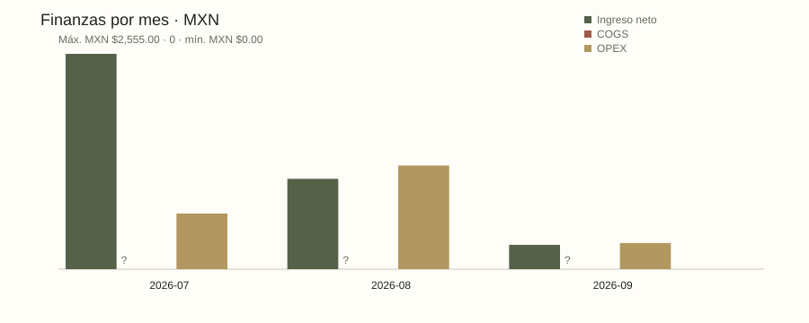
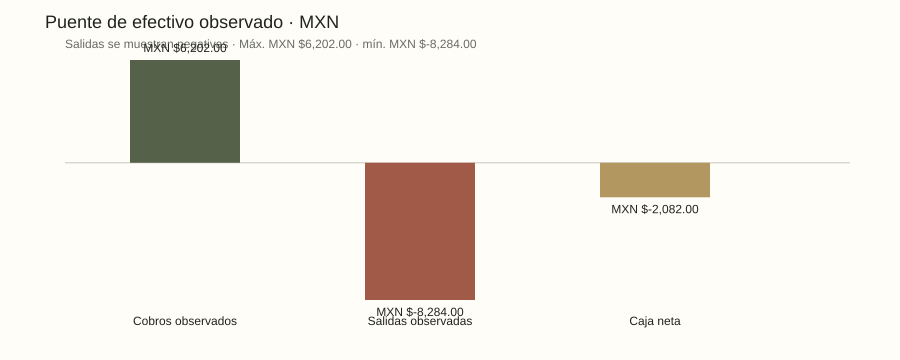
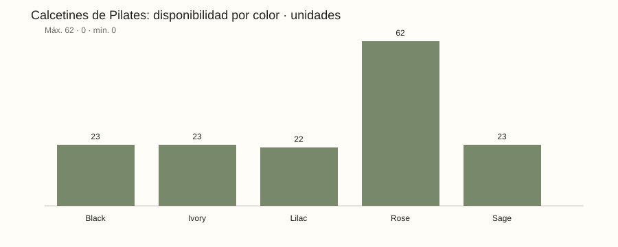

# Alma de Lujo — reporte analítico

&gt; **DATOS SINTÉTICOS.** Este documento es reproducible y no describe ventas, demanda ni operación real.

Corte: 2026-09-21 · escenario: missing_cost · estado: BLOCKED · política: Provisional.

## Hallazgos calculados
- Ingresos netos reconocidos: MXN $3,916.00.
- Valor de inventario a costo: Sin datos.
- Sin datos SKU(s) con estado de revisión, reposición o agotado en este escenario sintético.
- Sin datos color(es) presentes en el inventario sintético.

## Finanzas
Ingreso bruto: MXN $4,031.00; descuentos: MXN $15.00; notas de crédito: MXN $100.00; COGS: Sin datos; OPEX: MXN $2,200.00; caja neta observada: MXN $-2,082.00.

## Inventario y color
Oportunidades de escenario: Sin datos. Los colores observados son: Sin datos. Esto no prueba una preferencia de compra.

## Canales y cohortes
| Canal | Visitas | Órdenes | Conversión |
| --- | --- | --- | --- |
| DM | Sin datos | 2 | Sin datos |
| Instagram | 620 | 3 | 0.48% |
| Organic | 300 | 2 | 0.33% |
| Paid Social | 410 | 1 | 0.24% |

Cohortes con madurez de 30 días: 2 de 2.

## Compras y catálogo
Compras: 3 · productos: 5.

## Fuentes, autoridad y límites
- Catálogo público Alma de Lujo · autoridad: Alma de Lujo; cobertura: Usuario confirmó ropa deportiva y calcetines de Pilates multicolor.; límite: Acceso automático sin contenido verificable. Prendas, precios y colores exactos pendientes de confirmación.; enlace: https://www.instagram.com/almadelujooo/
- MOPRADEF 2025 · autoridad: INEGI; cobertura: Contexto nacional de actividad física; cambio conceptual y metodológico en 2025.; límite: No mide demanda ni ventas de Alma o calcetines de Pilates. Comparabilidad temporal requiere revisar metodología.; enlace: https://www.inegi.org.mx/programas/mopradef/default.html?init=1
- Estudio de Venta Online 2026 · autoridad: AMVO; cobertura: Página pública del estudio de comercio electrónico mexicano.; límite: Resumen descargable requiere formulario; no se descargó ni se usaron cifras. Mercado agregado no demuestra oportunidad específica.; enlace: https://amvo.org.mx/descarga-evo-2026
- Interés de búsqueda: Pilates y calcetines · autoridad: Google Trends; cobertura: Fuente candidata; sin extracción ni observación realizada.; límite: Interés relativo no equivale a demanda, tamaño de mercado ni ventas.; enlace: https://trends.google.com/trends/

## Experimentos
### EXP-SOCKS-01: Validar calcetines de Pilates como producto principal
Hipótesis: La preferencia expresada por la dueña podría traducirse en contribución por visita superior al resto del catálogo.

Métrica primaria: Contribución por visita elegible con costo y atribución completos. Guardarraíl: Tasa de devolución &lt;= 10%, ningún SKU sobrevendido; costos y tráfico conocidos. Ventana: 28 días desde aprobación; no detener por resultados favorables tempranos. Población: Visitas nuevas elegibles asignadas aleatoriamente 1:1 a dos vitrinas con igual precio y exposición. Cierre: Antes de iniciar: fijar MDE y muestra con baseline. Cerrar a 28 días; si falta muestra o trazabilidad =&gt; INCONCLUSO. Sin baseline no lanzar ni afirmar causalidad..

### EXP-COLOR-02: Preferencia de color de calcetines
Hipótesis: Las solicitudes de color pueden orientar un siguiente lote pequeño.

Métrica primaria: Proporción de intención explícita por color entre respuestas válidas. Guardarraíl: Una respuesta por participante sintético; registrar sin preferencia y faltantes; no comprar automáticamente. Ventana: 14 días desde aprobación. Población: Participantes que voluntariamente responden una encuesta; sesgo de autoselección explícito. Cierre: Consolidar conteos y cobertura al día 14; menos de 30 respuestas =&gt; INCONCLUSO. Intención no demuestra compra..

## Decisiones y evidencia
- Revisar y corregir evidencia faltante antes de usar indicadores. (ejecución: BLOCKED; aprobación humana: True)
- Revisar el puente ingreso-costo-gastos-efectivo y la política provisional con la dueña. (ejecución: BLOCKED; aprobación humana: True)
- Revisar la población, métrica, guardrail, ventana y criterio de cierre de EXP-SOCKS-01 y EXP-COLOR-02 antes de aprobar cualquier ejecución. (ejecución: BLOCKED; aprobación humana: True)

Las referencias de evidencia se conservan en `report.json`; los enlaces externos no se descargan ni ejecutan.

## Puente financiero completo
| Componente | Valor |
| --- | --- |
| Ingreso bruto | MXN $4,031.00 |
| Descuentos | MXN $15.00 |
| Notas de crédito | MXN $100.00 |
| Ingreso neto reconocido | MXN $3,916.00 |
| COGS | Sin datos |
| Utilidad bruta | Sin datos |
| Margen bruto | Sin datos |
| OPEX | MXN $2,200.00 |
| Contribución | Sin datos |
| Proxy operativo | Sin datos |
| Cobros observados | MXN $6,202.00 |
| Salidas observadas | MXN $8,284.00 |
| Caja neta observada | MXN $-2,082.00 |

## Detalle de inventario, compras y catálogo
| SKU | Color | Disponible | En tránsito | Estado |
| --- | --- | --- | --- | --- |
| var-sock-black | Black | 23 | 0 | SLOW |
| var-sock-ivory | Ivory | 23 | 0 | SLOW |
| var-sock-rose | Rose | 62 | 0 | HEALTHY |
| var-sock-sage | Sage | 23 | 0 | SLOW |
| var-sock-lilac | Lilac | 22 | 0 | UNKNOWN |
| var-legging-black | Black | 29 | 6 | SLOW |
| var-legging-navy | Navy | 10 | 0 | SLOW |
| var-top-black | Black | 12 | 0 | PRELAUNCH |
| var-top-sand | Sand | 12 | 0 | PRELAUNCH |
| var-short-black | Black | 11 | 0 | SLOW |
| var-short-coral | Coral | 10 | 30 | SLOW |
| var-wrap-sand | Sand | 0 | 0 | PRELAUNCH |

| Compra | Proveedor | SKU | Pedidas | Recibidas | Estado |
| --- | --- | --- | --- | --- | --- |
| po-001 | Synthetic Grip Goods | var-sock-rose | 40 | 40 | received |
| po-002 | Synthetic Studio Textiles | var-legging-black | 24 | 18 | partial |
| po-003 | Synthetic Studio Textiles | var-short-coral | 30 | 0 | in_transit |

| Producto | Categoría | Colección | Ciclo |
| --- | --- | --- | --- |
| Grip Pilates Socks | Pilates socks | Studio Essentials | launched |
| Flow Leggings | Sportswear | Flow | launched |
| Sculpt Studio Top | Sportswear | Studio Essentials | sample |
| Move Biker Shorts | Sportswear | Move | clearance |
| Recovery Wrap Concept | Sportswear | Future Concepts | idea |
