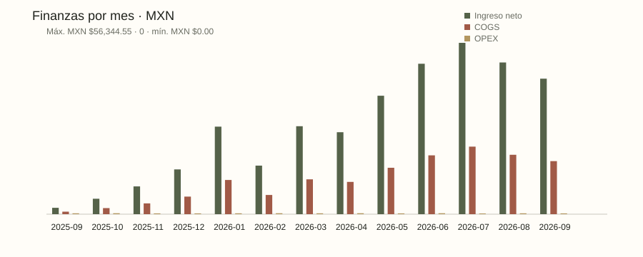
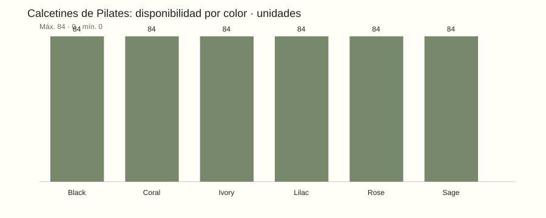
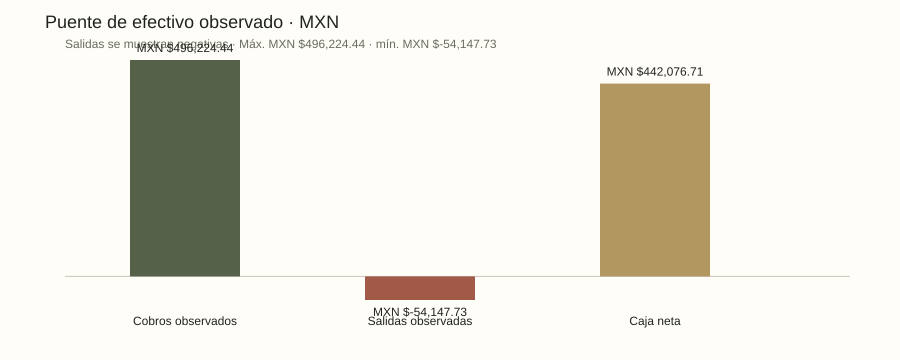

# Alma de Lujo — dossier analítico v0.2

**DATOS COMERCIALES SINTÉTICOS.** Esta simulación verifica procesos y decisiones; no describe ventas, clientas o rentabilidad reales.

Corte: 2026-09-21 · escenario: normal · semilla: 42 · moneda: MXN (campos monetarios en centavos).

## Mapa de datos

| tabla | filas | cobertura |
| --- | --- | --- |
| products | 5 | True |
| variants | 46 | True |
| suppliers | 3 | True |
| purchase_orders | 46 | True |
| customers | 400 | True |
| orders | 1200 | True |
| order_items | 1805 | True |
| payments | 1477 | True |
| refunds | 61 | True |
| credit_notes | 61 | True |
| returns | 61 | True |
| movements | 1525 | True |
| reservations | 1805 | True |
| expenses | 26 | True |
| funnel | 13 | True |
| unmet_demand | 7 | True |
| campaigns | 4 | True |
| content_assets | 4 | True |
| sessions | 9230 | True |
| leads | 2830 | True |
| purchase_receipts | 54 | True |
| supplier_payments | 57 | True |
| shipments | 924 | True |
| invoices | 984 | True |
| expense_payments | 26 | True |
| inventory_counts | 46 | True |
| experiments | 1 | True |
| experiment_assignments | 67 | True |
| experiment_outcomes | 67 | True |
| lifecycle_events | 9 | True |

## Cómo leer el resultado

Las tablas detalladas se encuentran en `tables/`, los modelos consultables en `marts/` y sus consultas SQL en `lineage.json`. El almacén SQLite contiene claves y relaciones. `quality.json` contiene los resultados de validación. Los seis procesos generan solicitudes para agentes nativos y conservan sus estados y transiciones en `processes/`. Un proceso esperando agente todavía no tiene una decisión revisada.

La utilidad y la caja tienen bases diferentes: entrega y créditos para ingresos de gestión; eventos de cobro, reembolso y pago para efectivo. El stock físico, reservas y tránsito tampoco son intercambiables. Los valores UNKNOWN permanecen desconocidos.

## Control de calidad

| status | resultado |
| --- | --- |
| PASS | Contratos base conciliados; consultar warehouse-load.json para controles relacionales. |

## cash_daily

Eventos de caja en fechas efectivas. Flujo acumulado parte de cero, no constituye saldo bancario conocido.

| date | cash_in_cents | refund_out_cents | supplier_out_cents | expense_out_cents | net_cash_change_cents | cumulative_cash_movement_cents | cash_coverage_known |
| --- | --- | --- | --- | --- | --- | --- | --- |
| 2025-09-22 | 74660 | 0 | 0 | 10092 | 64568 | 64568 | 1 |
| 2025-09-23 | 181083 | 0 | 0 | 0 | 181083 | 245651 | 1 |
| 2025-09-24 | 58071 | 0 | 0 | 8710 | 49361 | 295012 | 1 |
| 2025-09-27 | 78189 | 0 | 0 | 0 | 78189 | 373201 | 1 |
| 2025-09-28 | 0 | 17606 | 0 | 0 | -17606 | 355595 | 1 |
| 2025-10-01 | 0 | 0 | 152600 | 12703 | -165303 | 190292 | 1 |
| 2025-10-02 | 0 | 0 | 112000 | 0 | -112000 | 78292 | 1 |
| 2025-10-03 | 0 | 0 | 210000 | 17711 | -227711 | -149419 | 1 |
| 2025-10-04 | 0 | 0 | 323400 | 0 | -323400 | -472819 | 1 |
| 2025-10-05 | 0 | 0 | 167100 | 0 | -167100 | -639919 | 1 |
| 2025-10-06 | 0 | 0 | 137600 | 0 | -137600 | -777519 | 1 |
| 2025-10-07 | 0 | 0 | 243100 | 0 | -243100 | -1020619 | 1 |
| 2025-10-08 | 0 | 0 | 240000 | 0 | -240000 | -1260619 | 1 |
| 2025-10-09 | 0 | 0 | 137900 | 0 | -137900 | -1398519 | 1 |
| 2025-10-10 | 0 | 0 | 133300 | 0 | -133300 | -1531819 | 1 |

Muestra de 15 de 335 filas. Tabla completa en el CSV/JSON correspondiente.

Tabla completa: [CSV](marts/cash_daily.csv) · [JSON](marts/cash_daily.json)

## channel_performance

Atribución descriptiva de pedidos y resultados por canal; no representa incremento causal por publicidad.

| channel | campaign_id | delivered_orders | customers | gross_revenue_cents | discount_cents | credit_note_cents | net_revenue_cents | cogs_cents | marketing_spend_cents | attribution_unknown | revenue_coverage_known |
| --- | --- | --- | --- | --- | --- | --- | --- | --- | --- | --- | --- |
| DM | camp-private | 139 | 112 | 7327700 | 412842 | 186070 | 6728788 | 2645800 | 31522 | 1 | 1 |
| Instagram | camp-studio | 279 | 209 | 15158200 | 831138 | 377217 | 13949845 | 5492500 | 40338 | 1 | 1 |
| Organic | organic | 188 | 160 | 9072100 | 484104 | 229094 | 8358902 | 3274800 | 36767 | 1 | 1 |
| Paid Social | camp-move | 166 | 139 | 8674200 | 487540 | 136738 | 8049922 | 3146700 | 38899 | 1 | 1 |

Tabla completa: [CSV](marts/channel_performance.csv) · [JSON](marts/channel_performance.json)

## customer_cohorts

Cohortes de primera entrega y maduración. Una cohorte reciente no tiene la misma ventana de oportunidad para recomprar.

| cohort_month | cohort_customers | eligible_customers_30d | immature_customers | repeat_within_30d_customers | repeat_within_30d_rate | cohort_coverage_known |
| --- | --- | --- | --- | --- | --- | --- |
| 2025-09 | 2 | 2 | 0 | 0 | 0.0 | 1 |
| 2025-10 | 10 | 10 | 0 | 3 | 0.3 | 1 |
| 2025-11 | 16 | 16 | 0 | 3 | 0.1875 | 1 |
| 2025-12 | 21 | 21 | 0 | 4 | 0.1905 | 1 |
| 2026-01 | 40 | 40 | 0 | 16 | 0.4 | 1 |
| 2026-02 | 18 | 18 | 0 | 3 | 0.1667 | 1 |
| 2026-03 | 30 | 30 | 0 | 10 | 0.3333 | 1 |
| 2026-04 | 28 | 28 | 0 | 12 | 0.4286 | 1 |
| 2026-05 | 44 | 44 | 0 | 14 | 0.3182 | 1 |
| 2026-06 | 43 | 43 | 0 | 17 | 0.3953 | 1 |
| 2026-07 | 42 | 42 | 0 | 19 | 0.4524 | 1 |
| 2026-08 | 36 | 24 | 12 | 13 | 0.5417 | 1 |
| 2026-09 | 27 | 0 | 27 | UNKNOWN | UNKNOWN | 1 |

Tabla completa: [CSV](marts/customer_cohorts.csv) · [JSON](marts/customer_cohorts.json)

## experiment_results

Asignación y resultados simulados por brazo. Evaluar incertidumbre y guardrails, nunca tratarlos como prueba de demanda real.

| experiment_id | name | status | primary_metric | guardrail | start_date | end_date | arm | assigned_customers | converted_customers | conversion_rate | net_revenue_cents | contribution_cents | returned_customers | outcome_coverage_known | synthetic_descriptive_only |
| --- | --- | --- | --- | --- | --- | --- | --- | --- | --- | --- | --- | --- | --- | --- | --- |
| exp-socks-01 | Synthetic Pilates socks vignette | completed | contribution_cents_per_visit | return_rate_under_10_percent | 2025-09-22 | 2025-11-17 | control | 32 | 13 | 0.40625 | 115637 | 71200 | 0 | 1 | 1 |
| exp-socks-01 | Synthetic Pilates socks vignette | completed | contribution_cents_per_visit | return_rate_under_10_percent | 2025-09-22 | 2025-11-17 | treatment | 35 | 12 | 0.34285714285714286 | 110512 | 77140 | 0 | 1 | 1 |

Tabla completa: [CSV](marts/experiment_results.csv) · [JSON](marts/experiment_results.json)

## finance_monthly

Reconocimiento, descuentos, créditos, costo y gastos de gestión. Márgenes retienen costos faltantes; no es contabilidad fiscal.

| month | net_revenue_cents | cogs_cents | gross_profit_cents | variable_expense_cents | expense_accrual_cents | contribution_after_variable_cents | operating_after_all_expenses_cents | net_cash_change_cents | revenue_coverage_known | cost_coverage_known | expense_coverage_known | cash_coverage_known |
| --- | --- | --- | --- | --- | --- | --- | --- | --- | --- | --- | --- | --- |
| 2025-09 | 209903 | 81600 | 128303 | 10092 | 27513 | 118211 | 100790 | 355595 | 1 | 1 | 1 | 1 |
| 2025-10 | 507018 | 200200 | 306818 | 12703 | 30414 | 294115 | 276404 | -3528734 | 1 | 1 | 1 | 1 |
| 2025-11 | 913128 | 355200 | 557928 | 11495 | 26202 | 546433 | 531726 | 1264731 | 1 | 1 | 1 | 1 |
| 2025-12 | 1472092 | 576700 | 895392 | 10905 | 26240 | 884487 | 869152 | 2043298 | 1 | 1 | 1 | 1 |
| 2026-01 | 2878729 | 1125200 | 1753529 | 10181 | 27762 | 1743348 | 1725767 | 3172270 | 1 | 1 | 1 | 1 |
| 2026-02 | 1595806 | 632600 | 963206 | 13807 | 30800 | 949399 | 932406 | 2291592 | 1 | 1 | 1 | 1 |
| 2026-03 | 2893397 | 1146200 | 1747197 | 9433 | 27266 | 1737764 | 1719931 | 3673491 | 1 | 1 | 1 | 1 |
| 2026-04 | 2695926 | 1062300 | 1633626 | 11935 | 30280 | 1621691 | 1603346 | 3970357 | 1 | 1 | 1 | 1 |
| 2026-05 | 3895510 | 1525900 | 2369610 | 9581 | 25920 | 2360029 | 2343690 | 4827108 | 1 | 1 | 1 | 1 |
| 2026-06 | 4946917 | 1935500 | 3011417 | 12389 | 30390 | 2999028 | 2981027 | 6694466 | 1 | 1 | 1 | 1 |
| 2026-07 | 5634455 | 2221300 | 3413155 | 10594 | 24632 | 3402561 | 3388523 | 6932946 | 1 | 1 | 1 | 1 |
| 2026-08 | 4988770 | 1952400 | 3036370 | 13927 | 27396 | 3022443 | 3008974 | 7930826 | 1 | 1 | 1 | 1 |
| 2026-09 | 4455806 | 1744700 | 2711106 | 10484 | 26538 | 2700622 | 2684568 | 4579725 | 1 | 1 | 1 | 1 |

Tabla completa: [CSV](marts/finance_monthly.csv) · [JSON](marts/finance_monthly.json)

## funnel_conversion

Eventos identificados por sesión, lead y pedido. Interpretar solo denominadores compatibles; no dividir totales independientes.

| channel | campaign_id | sessions | all_leads | linked_leads | unlinked_leads | session_linked_leads | linked_orders | marketing_spend_cents | session_to_lead_rate | lead_to_linked_order_rate | funnel_coverage_known |
| --- | --- | --- | --- | --- | --- | --- | --- | --- | --- | --- | --- |
| DM | camp-private | 2204 | 604 | 604 | 0 | 604 | 189 | 31522 | 0.274 | 0.3129 | 1 |
| Instagram | camp-studio | 2443 | 843 | 843 | 0 | 843 | 409 | 40338 | 0.3451 | 0.4852 | 1 |
| Organic | organic | 2297 | 697 | 697 | 0 | 697 | 278 | 36767 | 0.3034 | 0.3989 | 1 |
| Paid Social | camp-move | 2286 | 686 | 686 | 0 | 686 | 264 | 38899 | 0.3001 | 0.3848 | 1 |

Tabla completa: [CSV](marts/funnel_conversion.csv) · [JSON](marts/funnel_conversion.json)

## inventory_aging

Actividad y antigüedad por SKU; la fecha más reciente de entrada no equivale a edad exacta por lote. Consultar definición.

| variant_id | product_id | product_name | category | lifecycle | color | size | cost_cents | ledger_on_hand_qty | reserved_qty | available_qty | in_transit_qty | count_date | counted_qty | count_discrepancy_qty | inventory_value_cents | trailing_30d_net_sold_qty | cover_days | stock_status | inventory_coverage_known | last_inbound_date | days_since_last_inbound |
| --- | --- | --- | --- | --- | --- | --- | --- | --- | --- | --- | --- | --- | --- | --- | --- | --- | --- | --- | --- | --- | --- |
| var-legging-black-l | prod-leggings | Flow Leggings | Sportswear | launched | Black | L | 11200 | 36 | 8 | 28 | 4 | 2026-09-21 | 36 | 0 | 403200 | 13 | 64.62 | AVAILABLE | 1 | 2025-10-22 | 334 |
| var-legging-black-m | prod-leggings | Flow Leggings | Sportswear | launched | Black | M | 11200 | 43 | 15 | 28 | 6 | 2026-09-21 | 43 | 0 | 481600 | 4 | 210.0 | AVAILABLE | 1 | 2026-01-10 | 254 |
| var-legging-black-s | prod-leggings | Flow Leggings | Sportswear | launched | Black | S | 11200 | 31 | 3 | 28 | 4 | 2026-09-21 | 31 | 0 | 347200 | 1 | 840.0 | AVAILABLE | 1 | 2026-06-02 | 111 |
| var-legging-navy-l | prod-leggings | Flow Leggings | Sportswear | launched | Navy | L | 11200 | 37 | 9 | 28 | 4 | 2026-09-21 | 37 | 0 | 414400 | 2 | 420.0 | AVAILABLE | 1 | 2025-12-30 | 265 |
| var-legging-navy-m | prod-leggings | Flow Leggings | Sportswear | launched | Navy | M | 11200 | 37 | 9 | 28 | 6 | 2026-09-21 | 37 | 0 | 414400 | 9 | 93.33 | AVAILABLE | 1 | 2025-10-21 | 335 |
| var-legging-navy-s | prod-leggings | Flow Leggings | Sportswear | launched | Navy | S | 11200 | 42 | 14 | 28 | 4 | 2026-09-21 | 42 | 0 | 470400 | 7 | 120.0 | AVAILABLE | 1 | 2025-10-20 | 336 |
| var-legging-olive-l | prod-leggings | Flow Leggings | Sportswear | launched | Olive | L | 11200 | 33 | 5 | 28 | 6 | 2026-09-21 | 33 | 0 | 369600 | 6 | 140.0 | AVAILABLE | 1 | 2025-10-02 | 354 |
| var-legging-olive-m | prod-leggings | Flow Leggings | Sportswear | launched | Olive | M | 11200 | 37 | 9 | 28 | 4 | 2026-09-21 | 37 | 0 | 414400 | 6 | 140.0 | AVAILABLE | 1 | 2025-10-04 | 352 |
| var-legging-olive-s | prod-leggings | Flow Leggings | Sportswear | launched | Olive | S | 11200 | 34 | 6 | 28 | 4 | 2026-09-21 | 34 | 0 | 380800 | 4 | 210.0 | AVAILABLE | 1 | 2025-09-30 | 356 |
| var-short-black-l | prod-shorts | Move Biker Shorts | Sportswear | clearance | Black | L | 7100 | 31 | 3 | 28 | 4 | 2026-09-21 | 31 | 0 | 220100 | 7 | 120.0 | AVAILABLE | 1 | 2025-10-14 | 342 |
| var-short-black-m | prod-shorts | Move Biker Shorts | Sportswear | clearance | Black | M | 7100 | 37 | 9 | 28 | 7 | 2026-09-21 | 37 | 0 | 262700 | 9 | 93.33 | AVAILABLE | 1 | 2026-08-25 | 27 |
| var-short-black-s | prod-shorts | Move Biker Shorts | Sportswear | clearance | Black | S | 7100 | 41 | 13 | 28 | 4 | 2026-09-21 | 41 | 0 | 291100 | 8 | 105.0 | AVAILABLE | 1 | 2025-10-12 | 344 |
| var-short-coral-l | prod-shorts | Move Biker Shorts | Sportswear | clearance | Coral | L | 7100 | 31 | 3 | 28 | 5 | 2026-09-21 | 31 | 0 | 220100 | 12 | 70.0 | AVAILABLE | 1 | 2025-10-17 | 339 |
| var-short-coral-m | prod-shorts | Move Biker Shorts | Sportswear | clearance | Coral | M | 7100 | 47 | 19 | 28 | 5 | 2026-09-21 | 47 | 0 | 333700 | 4 | 210.0 | AVAILABLE | 1 | 2025-10-19 | 337 |
| var-short-coral-s | prod-shorts | Move Biker Shorts | Sportswear | clearance | Coral | S | 7100 | 44 | 16 | 28 | 4 | 2026-09-21 | 44 | 0 | 312400 | 8 | 105.0 | AVAILABLE | 1 | 2025-10-15 | 341 |

Muestra de 15 de 46 filas. Tabla completa en el CSV/JSON correspondiente.

Tabla completa: [CSV](marts/inventory_aging.csv) · [JSON](marts/inventory_aging.json)

## inventory_position

Existencia del ledger, reservas, disponible y tránsito por variante. Revisar discrepancias de conteo antes de decidir compra.

| variant_id | product_id | product_name | category | lifecycle | color | size | cost_cents | ledger_on_hand_qty | reserved_qty | available_qty | in_transit_qty | count_date | counted_qty | count_discrepancy_qty | inventory_value_cents | trailing_30d_net_sold_qty | cover_days | stock_status | inventory_coverage_known |
| --- | --- | --- | --- | --- | --- | --- | --- | --- | --- | --- | --- | --- | --- | --- | --- | --- | --- | --- | --- |
| var-legging-black-l | prod-leggings | Flow Leggings | Sportswear | launched | Black | L | 11200 | 36 | 8 | 28 | 4 | 2026-09-21 | 36 | 0 | 403200 | 13 | 64.62 | AVAILABLE | 1 |
| var-legging-black-m | prod-leggings | Flow Leggings | Sportswear | launched | Black | M | 11200 | 43 | 15 | 28 | 6 | 2026-09-21 | 43 | 0 | 481600 | 4 | 210.0 | AVAILABLE | 1 |
| var-legging-black-s | prod-leggings | Flow Leggings | Sportswear | launched | Black | S | 11200 | 31 | 3 | 28 | 4 | 2026-09-21 | 31 | 0 | 347200 | 1 | 840.0 | AVAILABLE | 1 |
| var-legging-navy-l | prod-leggings | Flow Leggings | Sportswear | launched | Navy | L | 11200 | 37 | 9 | 28 | 4 | 2026-09-21 | 37 | 0 | 414400 | 2 | 420.0 | AVAILABLE | 1 |
| var-legging-navy-m | prod-leggings | Flow Leggings | Sportswear | launched | Navy | M | 11200 | 37 | 9 | 28 | 6 | 2026-09-21 | 37 | 0 | 414400 | 9 | 93.33 | AVAILABLE | 1 |
| var-legging-navy-s | prod-leggings | Flow Leggings | Sportswear | launched | Navy | S | 11200 | 42 | 14 | 28 | 4 | 2026-09-21 | 42 | 0 | 470400 | 7 | 120.0 | AVAILABLE | 1 |
| var-legging-olive-l | prod-leggings | Flow Leggings | Sportswear | launched | Olive | L | 11200 | 33 | 5 | 28 | 6 | 2026-09-21 | 33 | 0 | 369600 | 6 | 140.0 | AVAILABLE | 1 |
| var-legging-olive-m | prod-leggings | Flow Leggings | Sportswear | launched | Olive | M | 11200 | 37 | 9 | 28 | 4 | 2026-09-21 | 37 | 0 | 414400 | 6 | 140.0 | AVAILABLE | 1 |
| var-legging-olive-s | prod-leggings | Flow Leggings | Sportswear | launched | Olive | S | 11200 | 34 | 6 | 28 | 4 | 2026-09-21 | 34 | 0 | 380800 | 4 | 210.0 | AVAILABLE | 1 |
| var-short-black-l | prod-shorts | Move Biker Shorts | Sportswear | clearance | Black | L | 7100 | 31 | 3 | 28 | 4 | 2026-09-21 | 31 | 0 | 220100 | 7 | 120.0 | AVAILABLE | 1 |
| var-short-black-m | prod-shorts | Move Biker Shorts | Sportswear | clearance | Black | M | 7100 | 37 | 9 | 28 | 7 | 2026-09-21 | 37 | 0 | 262700 | 9 | 93.33 | AVAILABLE | 1 |
| var-short-black-s | prod-shorts | Move Biker Shorts | Sportswear | clearance | Black | S | 7100 | 41 | 13 | 28 | 4 | 2026-09-21 | 41 | 0 | 291100 | 8 | 105.0 | AVAILABLE | 1 |
| var-short-coral-l | prod-shorts | Move Biker Shorts | Sportswear | clearance | Coral | L | 7100 | 31 | 3 | 28 | 5 | 2026-09-21 | 31 | 0 | 220100 | 12 | 70.0 | AVAILABLE | 1 |
| var-short-coral-m | prod-shorts | Move Biker Shorts | Sportswear | clearance | Coral | M | 7100 | 47 | 19 | 28 | 5 | 2026-09-21 | 47 | 0 | 333700 | 4 | 210.0 | AVAILABLE | 1 |
| var-short-coral-s | prod-shorts | Move Biker Shorts | Sportswear | clearance | Coral | S | 7100 | 44 | 16 | 28 | 4 | 2026-09-21 | 44 | 0 | 312400 | 8 | 105.0 | AVAILABLE | 1 |

Muestra de 15 de 46 filas. Tabla completa en el CSV/JSON correspondiente.

Tabla completa: [CSV](marts/inventory_position.csv) · [JSON](marts/inventory_position.json)

## procurement

Compras comprometidas, recibidas y pagos; el valor pendiente no es una nueva salida automática.

| purchase_order_id | ordered_date | supplier_id | variant_id | ordered_qty | received_qty | open_qty | unit_cost_cents | ordered_value_cents | paid_cents | receipt_event_qty | supplier_payment_event_cents | reconciled | coverage_known |
| --- | --- | --- | --- | --- | --- | --- | --- | --- | --- | --- | --- | --- | --- |
| po-00001 | 2025-09-25 | sup-grip | var-sock-black-s | 22 | 14 | 8 | 4200 | 92400 | 58800 | 14 | 58800 | 1 | 1 |
| po-00024 | 2025-09-25 | sup-move | var-legging-navy-l | 15 | 11 | 4 | 11200 | 168000 | 123200 | 11 | 123200 | 1 | 1 |
| po-00002 | 2025-09-26 | sup-studio | var-sock-black-m | 24 | 16 | 8 | 4200 | 100800 | 67200 | 16 | 67200 | 1 | 1 |
| po-00025 | 2025-09-26 | sup-grip | var-legging-olive-s | 12 | 8 | 4 | 11200 | 134400 | 89600 | 8 | 89600 | 1 | 1 |
| po-00003 | 2025-09-27 | sup-move | var-sock-black-l | 28 | 19 | 9 | 4200 | 117600 | 79800 | 19 | 79800 | 1 | 1 |
| po-00026 | 2025-09-27 | sup-studio | var-legging-olive-m | 13 | 9 | 4 | 11200 | 145600 | 100800 | 9 | 100800 | 1 | 1 |
| po-00004 | 2025-09-28 | sup-grip | var-sock-ivory-s | 43 | 29 | 14 | 4200 | 180600 | 121800 | 29 | 121800 | 1 | 1 |
| po-00027 | 2025-09-28 | sup-move | var-legging-olive-l | 20 | 14 | 6 | 11200 | 224000 | 156800 | 14 | 156800 | 1 | 1 |
| po-00005 | 2025-09-29 | sup-studio | var-sock-ivory-m | 32 | 21 | 11 | 4200 | 134400 | 88200 | 21 | 88200 | 1 | 1 |
| po-00028 | 2025-09-29 | sup-grip | var-top-black-s | 21 | 15 | 6 | 8200 | 172200 | 123000 | 15 | 123000 | 1 | 1 |
| po-00006 | 2025-09-30 | sup-move | var-sock-ivory-l | 35 | 23 | 12 | 4200 | 147000 | 96600 | 23 | 96600 | 1 | 1 |
| po-00029 | 2025-09-30 | sup-studio | var-top-black-m | 15 | 10 | 5 | 8200 | 123000 | 82000 | 10 | 82000 | 1 | 1 |
| po-00007 | 2025-10-01 | sup-grip | var-sock-rose-s | 32 | 22 | 10 | 4200 | 134400 | 92400 | 22 | 92400 | 1 | 1 |
| po-00030 | 2025-10-01 | sup-move | var-top-black-l | 19 | 13 | 6 | 8200 | 155800 | 106600 | 13 | 106600 | 1 | 1 |
| po-00008 | 2025-10-02 | sup-studio | var-sock-rose-m | 32 | 22 | 10 | 4200 | 134400 | 92400 | 22 | 92400 | 1 | 1 |

Muestra de 15 de 46 filas. Tabla completa en el CSV/JSON correspondiente.

Tabla completa: [CSV](marts/procurement.csv) · [JSON](marts/procurement.json)

## reconciliation

Conciliación entre documentos, eventos y ledger. Las divergencias de conteo son problemas de negocio y requieren revisión.

| check_id | source_cents | mart_cents | passed |
| --- | --- | --- | --- |
| sales_net_revenue | 37087457 | 37087457 | 1 |
| cash_in | 49622444 | 49622444 | 1 |
| cash_out | 5414773 | 5414773 | 1 |
| purchase_receipts | 663 | 663 | 1 |
| supplier_payments | 4158000 | 4158000 | 1 |
| marketing_spend | 147526 | 147526 | 1 |

Tabla completa: [CSV](marts/reconciliation.csv) · [JSON](marts/reconciliation.json)

## sales_daily

Ventas reconocidas por fecha de entrega y créditos en su fecha; no pedidos captados ni efectivo cobrado.

| date | gross_revenue_cents | discount_cents | credit_note_cents | net_revenue_cents | cogs_cents | gross_profit_cents | revenue_coverage_known | cost_coverage_known |
| --- | --- | --- | --- | --- | --- | --- | --- | --- |
| 2025-09-25 | 157400 | 8080 | 0 | 149320 | 59000 | 90320 | 1 | 1 |
| 2025-09-28 | 0 | 0 | 17606 | -17606 | -7100 | -10506 | 1 | 1 |
| 2025-09-29 | 80500 | 2311 | 0 | 78189 | 29700 | 48489 | 1 | 1 |
| 2025-10-15 | 92400 | 7051 | 0 | 85349 | 33900 | 51449 | 1 | 1 |
| 2025-10-21 | 59800 | 5365 | 0 | 54435 | 22400 | 32035 | 1 | 1 |
| 2025-10-23 | 37800 | 2500 | 0 | 35300 | 14200 | 21100 | 1 | 1 |
| 2025-10-26 | 98400 | 5273 | 0 | 93127 | 36100 | 57027 | 1 | 1 |
| 2025-10-27 | 11900 | 976 | 0 | 10924 | 4200 | 6724 | 1 | 1 |
| 2025-10-28 | 138300 | 8169 | 0 | 130131 | 51300 | 78831 | 1 | 1 |
| 2025-10-30 | 80500 | 5592 | 0 | 74908 | 29700 | 45208 | 1 | 1 |
| 2025-10-31 | 23800 | 956 | 0 | 22844 | 8400 | 14444 | 1 | 1 |
| 2025-11-02 | 47600 | 1497 | 14300 | 31803 | 16800 | 15003 | 1 | 1 |
| 2025-11-03 | 92400 | 3263 | 0 | 89137 | 33900 | 55237 | 1 | 1 |
| 2025-11-06 | 79500 | 5123 | 0 | 74377 | 29000 | 45377 | 1 | 1 |
| 2025-11-07 | 131300 | 6929 | 0 | 124371 | 48400 | 75971 | 1 | 1 |

Muestra de 15 de 277 filas. Tabla completa en el CSV/JSON correspondiente.

Tabla completa: [CSV](marts/sales_daily.csv) · [JSON](marts/sales_daily.json)

## Investigación y decisión

El registro `research.json` conserva fuentes públicas, población, fecha, acceso y límites. MOPRADEF sirve de contexto; no estima compras de calcetines. El producto ganador sigue siendo una hipótesis del negocio. La revisión de agentes debe proponer pruebas con métrica primaria, guardrail, población, ventana y cierre.

## Procesos y responsabilidades

| Proceso | Responsable funcional | Entregable |
| --- | --- | --- |
| procure-to-stock | Compras e inventario | Propuesta por variante y capital requerido |
| lead-to-delivery | Operación comercial | Diagnóstico de conversión y entrega |
| return-to-refund | Postventa | Conciliación de devolución, crédito y reembolso |
| finance-close | Finanzas de gestión | Puente de utilidad y caja |
| weekly-growth-review | Crecimiento | Aprendizaje de cohortes y experimentos |
| market-to-experiment | Investigación | Prueba de demanda con regla de abandono |

## Gráficos reproducibles

