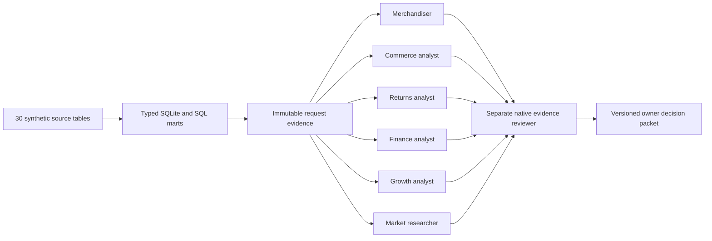

# Native analytical agent system

Version 2.0. This is a local analytics project with a native Codex request/response bridge. `alma/native_agents.py` contains contracts and validation, not a fabricated model client. Python computes exact rules; Codex agents perform bounded interpretation, critique and experiment design.

| Role | Contract | Required reasoning | Read tools | Output |
| --- | --- | --- | --- | --- |
| Merchandiser | `agents/merchandiser.json` | Color/size, stock cover, lifecycle, capital and alternative explanation | Inventory, aging, procurement, reconciliation | Evidence and replenishment/learning proposal |
| Commerce | `agents/commerce_analyst.json` | Linked funnel, fulfilment and attribution gaps | Funnel, channels, daily sales | Measurable conversion/fulfilment proposal |
| Returns | `agents/returns_analyst.json` | Physical return, credit, refund and restock separation | Finance, cash, inventory, reconciliation | Resolution/reconciliation proposal |
| Finance | `agents/finance_analyst.json` | Recognition versus cash, obligations, missing costs | Monthly finance, daily cash, procurement | Management finance decision packet |
| Growth | `agents/growth_analyst.json` | Mature cohorts, contribution, uncertainty and guardrails | Channels, cohorts, experiments, funnel | Fixed-window experiment decision |
| Market | `agents/market_researcher.json` | Source limits, population comparability, falsifiable hypothesis | Public source register and selected marts | Demand test with abandonment rule |
| Reviewer | `agents/evidence_reviewer.json` | Independent challenge of facts, methods and authority | Same bound evidence plus analyst response | BLOCKED, REVIEW or READY_FOR_OWNER |

Each role uses the same inspect → question → query → alternative explanation → evidenced observations → proposal → review loop. The concrete questions, facts and recommendations come from a native model response, not the deterministic `alma/decisions.py` v0.1 baseline.

## Binding and validation

A request binds the dataset metadata, source counts, mart rows, quality, source register, experiment diagnostics and SQL lineage by SHA-256. Every observation has a JSON pointer and an exact scalar value equal to its source. Inferences carry `value: null` and are labeled. The validator rejects stale hashes, missing refs, invented numeric values, authority escalation, missing metric/guardrail/window/population/closure, and an analyst acting as its own reviewer.

Schema validation cannot prove the truth of arbitrary prose. An independent native reviewer checks semantic meaning, comparisons and causal claims. Dispatch receipts are parent-runtime attestations with actual model/task ID/effort/times/output hash/retry history; they are not cryptographically signed provider attestations. Test fixtures are separate from delivered live runs.

## Execution and portability

`python -m alma workspace` creates requests and leaves processes at `WAITING_AGENT`. This environment's standalone Codex CLI reports no login; the native Codex task runtime is available and is used for delivered agent runs. No API key, paid external provider or fake unattended worker is installed.

The repeatable native operating procedure is [RUN-NATIVE-CYCLE.md](../agents/RUN-NATIVE-CYCLE.md). The current task may dispatch native workers and return their structured outputs, validate them, record dispatch provenance, submit and resume. A terminal-only/offline replay validates existing recorded outputs without claiming new inference. Source files remain synthetic-only. Agents cannot place orders, issue refunds, change prices, publish content or contact clients.
