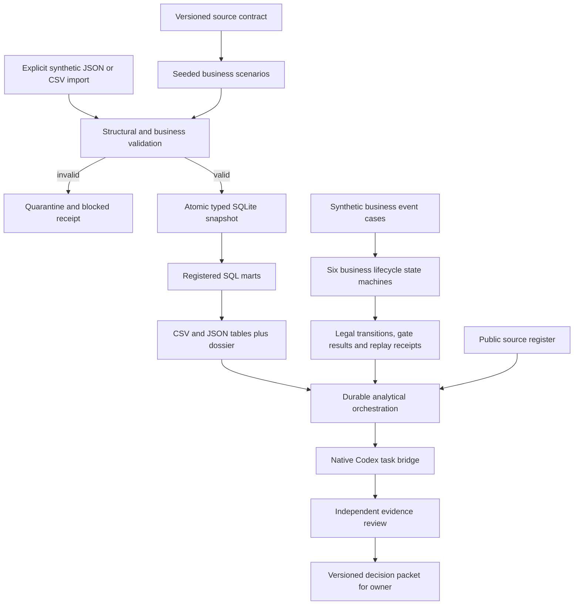

# v0.2 architecture and data boundaries

The product is an analytical information and decision system. Its deliverables are datasets, relational tables, SQL models, process histories, native-agent reasoning, reports and reviewed proposals. It has no HTTP server, web frontend, CRM or transaction execution service.

| Boundary | Enforcement | Failure behavior |
| --- | --- | --- |
| Input → canonical snapshot | Exact fields, integer cents, dates, synthetic marker, PK/FK, event reconciliations | Reject/quarantine; prior accepted snapshot survives |
| Snapshot → SQL | Fixed SQL files, defined grains, coverage propagation, independent total checks | Unknown retained; failed controls withhold trust |
| Event → business lifecycle | Allow-listed transitions, state-aware gates, immutable idempotency key | Illegal transitions and conflicting duplicates preserve facts |
| Marts → native request | Canonical evidence and contract hashes | Changed inputs require a new workspace |
| Native response → review | Exact-value source pointers, required uncertainty and action fields | Reject stale/invalid responses |
| Analyst → reviewer → packet | Separate native task, hash binding and semantic critique | Material error blocks; otherwise review/owner decision |
| Packet → external business | No external executor exists | Purchase/payment/refund/publication remain proposals |

## Money, time and evidence

Monetary facts use integer MXN cents. Order creation, invoice-like management statement, payment settlement, shipment, delivery, credit, physical return and refund each preserve their date. Supplier payment and expense payment have actual event tables. Formal accounting, CFDI, tax treatment and bank balances are outside this management model.

Canonical business rows are synthetic. Public market observations are separately attributed and cannot be joined to simulated orders to estimate real demand. The generated SQLite file is a reproducible local artifact; CSV/JSON exports and versioned SQL are the portable evidence. No cost savings, business adoption or sales impact is claimed from tests.

## Changes and replay

Contracts are versioned. Same snapshot ingest is a no-op; a different payload is not silently accepted as the same batch. A changed data/SQL/process contract should produce a new output directory. An interrupted analytical request can resume from its waiting state. Business-event persistence and its failure receipts live separately from analytical task scheduling; the distinction is explicit in the two process catalogs.
