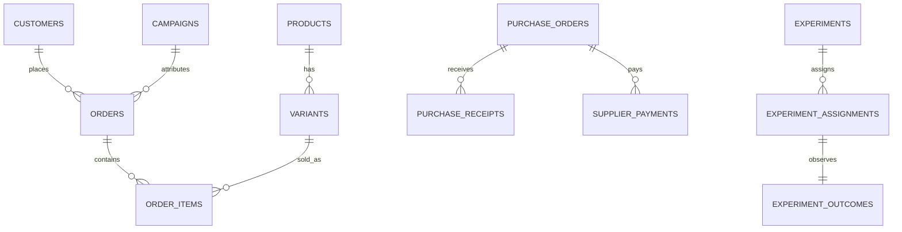

# Warehouse v2 data dictionary

The warehouse accepts only the synthetic `2.0` snapshot contract. Every source
row has a text primary key, ISO calendar dates, and MXN integer cents. SQLite
foreign-key enforcement is on for creation and load. `coverage` is a separate,
explicit fact: an absent or partial source never becomes a measured zero.

| Domain | Relations | Grain and key relationships |
|---|---|---|
| Catalog | `products`, `variants`, `lifecycle_events` | One row per product and sellable SKU; variant belongs to product. Lifecycle events retain product stage history. `cost_cents` may be unknown. |
| Supply and inventory | `suppliers`, `purchase_orders`, `purchase_receipts`, `supplier_payments`, `movements`, `reservations`, `inventory_counts`, `unmet_demand` | PO is supplier x SKU. Receipt/payment are event rows and reconcile to PO received/paid values. Movement is SKU x event; reservation is order-line state; count is physical SKU as-of event. |
| Customer and commerce | `customers`, `orders`, `order_items`, `payments`, `refunds`, `credit_notes`, `returns`, `shipments`, `invoices` | Order has customer and campaign; item has order and SKU. Payments/refunds are actual cash events. Credit notes reduce recognized revenue; returns are physical facts. Invoice is a non-fiscal management statement. |
| Growth | `campaigns`, `content_assets`, `sessions`, `leads`, `funnel` | Campaign bounds each attributed event. Session/lead may have nullable customer, asset, session, order, or variant where the event did not identify it. Funnel is descriptive aggregate data. |
| Experiments | `experiments`, `experiment_assignments`, `experiment_outcomes` | Assignment is unique per experiment/customer; exactly one simulated outcome belongs to each assignment. |

## Invariants

- `purchase_receipts.quantity = purchase_orders.received_qty` by PO; supplier
  and expense payment event sums equal their declared paid cents.
- A return must follow delivery and cannot exceed its order line. Only a return
  with `restock=1` creates a positive `movements.kind='return'` event. COGS is
  reversed on that event date; written-off returns do not reverse COGS.
- Cash marts use event dates from settled payments, settled refunds, supplier
  payments, and expense payments. Accrual amount and payment are separate.
- Customer, campaign, and experiment time boundaries are checked at ingest.
- A linked lead retains its session/order customer, channel, campaign and
  chronology. Covered shipped/delivered orders require a consistent shipment
  and full settled prepayment before shipment.
- Covered experiment outcomes occur after assignment; missing outcome coverage
  remains unknown in experiment marts. Lifecycle event history must end at the
  product's current lifecycle when covered.
- All currency is `INTEGER` cents. `NULL` cost or uncovered source means an
  affected margin/ratio is unknown.

